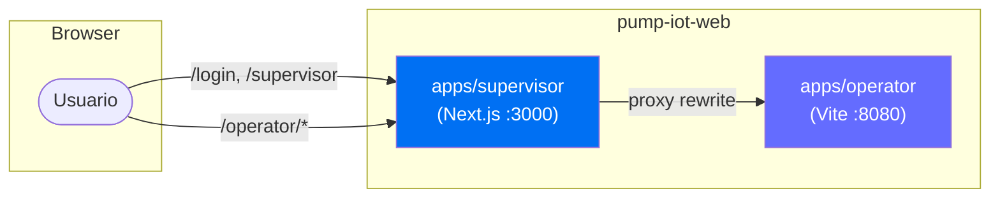
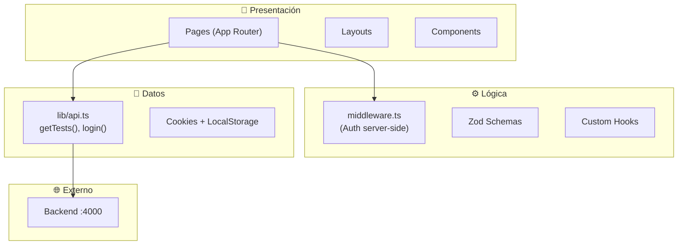
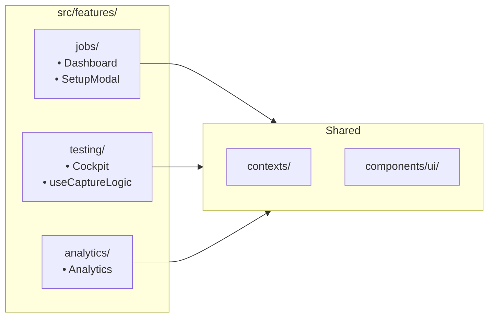
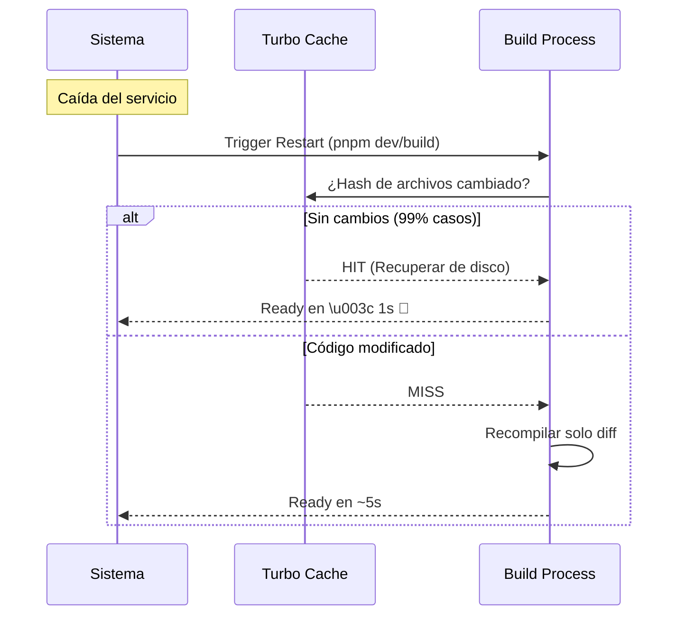

# Arquitectura del Proyecto - Pump IoT Platform

**Versión**: 2.0  
**Fecha**: 22 Enero 2026  
**Estructura**: Monorepo (PNPM Workspaces + Turbo)

---

## 1. Resumen Ejecutivo

Plataforma industrial para pruebas de bombas hidráulicas. Arquitectura **monorepo** con dos aplicaciones frontend independientes servidas bajo un mismo dominio.

### Stack Tecnológico

| Tecnología       | Versión | Propósito                        |
| ---------------- | ------- | -------------------------------- |
| **PNPM**         | 9.x     | Package Manager + Workspaces     |
| **Turbo**        | 2.x     | Build System / Dev orchestration |
| **Next.js**      | 16.1.1  | Supervisor App (SSR)             |
| **Vite**         | 6.x     | Operator App (SPA)               |
| **React**        | 19.x    | UI Library                       |
| **TypeScript**   | 5.x     | Tipado estático                  |
| **Tailwind CSS** | 4.x     | Utilidades CSS                   |
| **Shadcn UI**    | latest  | Componentes UI                   |

---

## 2. Estructura del Monorepo

```text
pump-iot-web/                    # Raíz del monorepo
├── apps/
│   ├── supervisor/              # 🖥️ Next.js (Dashboard/Gestión)
│   │   ├── src/
│   │   │   ├── app/             # App Router
│   │   │   ├── components/      # UI Components
│   │   │   ├── lib/
│   │   │   │   ├── api.ts       # ✅ Centralized API client
│   │   │   │   └── schemas.ts   # Zod validation
│   │   │   └── hooks/
│   │   ├── middleware.ts        # ✅ Server-side auth (NEW)
│   │   └── public/docs/         # Documentation portal
│   │
│   └── operator/                # 🔧 Vite (Testing Cockpit)
│       └── src/
│           ├── contexts/        # ✅ Isolated Providers (NEW)
│           │   ├── NavigationProvider.tsx
│           │   ├── JobProvider.tsx
│           │   ├── TelemetryProvider.tsx
│           │   └── index.ts
│           ├── hooks/
│           │   └── useCaptureLogic.ts  # ✅ Extracted logic (NEW)
│           ├── features/        # ✅ Feature-Based Structure (NEW)
│           │   ├── testing/
│           │   ├── jobs/
│           │   ├── analytics/
│           │   └── index.ts
│           ├── views/           # Main view components
│           └── components/      # Shared UI
│
├── docs/                        # Technical documentation
├── pnpm-workspace.yaml          # Workspace config
├── turbo.json                   # Turbo pipeline
└── package.json                 # Root scripts
```

---

## 3. Integración de Aplicaciones



### Mecanismo de Proxy

- Next.js sirve en `localhost:3000`
- Vite sirve en `localhost:8080` con `base: "/operator/"`
- Next.js `rewrites` redirige `/operator/**` → Vite

---

## 4. Arquitectura SOLID Aplicada

### Antes vs Después (Operator App)

| Aspecto            | Antes                           | Después                             |
| ------------------ | ------------------------------- | ----------------------------------- |
| **Contextos**      | 1 "God Object" (TestingContext) | 3 providers especializados          |
| **Re-renders**     | 2/s en toda la app              | 0/s fuera del cockpit               |
| **Business Logic** | Mezclada en componentes         | Hooks dedicados (`useCaptureLogic`) |
| **Imports**        | Directos a archivos             | Features con public API             |

### Provider Composition

```tsx
// apps/operator/src/pages/Index.tsx
<NavigationProvider>
  {" "}
  {/* Vista actual */}
  <JobProvider>
    {" "}
    {/* Trabajo seleccionado */}
    <TelemetryProvider>
      {" "}
      {/* Datos 500ms (aislado) */}
      <AppContent />
    </TelemetryProvider>
  </JobProvider>
</NavigationProvider>
```

---

## 5. Supervisor App - Capas



### Optimizaciones Aplicadas

| Regla Vercel                     | Implementación                           |
| -------------------------------- | ---------------------------------------- |
| `bundle-dynamic-imports`         | `ImportModal` cargado con `next/dynamic` |
| `rerender-memo`                  | `useMemo` para columnas y filtros        |
| `rendering-hydration-no-flicker` | `middleware.ts` para auth                |

---

## 6. Operator App - Features



### Feature Public API Pattern

```typescript
// features/testing/index.ts
export { Cockpit } from "../../../views/Cockpit";
export { useCaptureLogic } from "./hooks/useCaptureLogic";
export {
  TelemetryProvider,
  useTelemetry,
} from "../../../contexts/TelemetryProvider";
```

---

## 7. Decisiones Arquitectónicas

### ¿Por qué Monorepo?

- **Desarrollo unificado**: `pnpm dev` levanta ambas apps
- **Compartir código**: Futuro `packages/shared` para utilidades
- **Despliegue independiente**: Cada app puede desplegarse por separado

### ¿Por qué Vite para Operator?

- **React Three Fiber**: Mejor compatibilidad con Vite
- **SPA pura**: No necesita SSR
- **HMR más rápido**: Ideal para desarrollo de UI 3D

### ¿Por qué Next.js para Supervisor?

- **SEO/SSR**: Posible portal público en futuro
- **Middleware**: Auth server-side nativo
- **API Routes**: Posible BFF (Backend for Frontend)

---

## 8. Comandos de Desarrollo

```bash
# Desarrollo (ambas apps en paralelo)
pnpm dev

# Build producción
pnpm build

# Solo Supervisor
pnpm --filter @pump-iot/supervisor dev

# Solo Operator
pnpm --filter @pump-iot/operator dev
```

---

## 9. Sistema de Build y Resiliencia Air-Gapped

La implementación de **Turbo** es crítica para garantizar la operación en entornos industriales sin conexión a internet (Air-Gapped).

### Beneficios Clave

1.  **Caché Local Persistente**: Turbo almacena los artefactos de compilación en `node_modules/.cache/turbo`. Esto significa que si el sistema se reinicia, no es necesario recompilar todo desde cero.
2.  **Zero Network Dependencies**: Una vez instaladas las dependencias (pnpm), el proceso de build es 100% offline. No requiere llamadas a servidores de vercel, npm registry, ni validaciones externas.
3.  **Recuperación Rápida**: En caso de fallo de un contenedor o servicio, el rebuild tarda milisegundos ("Full Turbo") para los componentes que no han cambiado, minimizando el tiempo de inactividad (Downtime).

### Flujo de Recuperación



---

## 10. Análisis Exhaustivo de Dependencias y Gobierno TI

Este reporte detalla la cadena de suministro de software (Software Supply Chain), identificando el respaldo corporativo y la viabilidad a largo plazo de cada tecnología crítica utilizada en el monorepo.

### 10.1 Infraestructura Crítica (Core)

| Tecnología     | Paquete      | Backing / Empresa         | Uso en Proyecto    | Estado & Longevidad                                                                                                       |
| -------------- | ------------ | ------------------------- | ------------------ | ------------------------------------------------------------------------------------------------------------------------- |
| **Turbo**      | `turbo`      | **Vercel**                | Sistema de Build   | **Estándar Industrial**. Escrito en Rust. Vercel ha levantado $313M+ en financiación, garantizando soporte a largo plazo. |
| **PNPM**       | `pnpm`       | Comunidad (Zoltan Kochan) | Gestor de Paquetes | **Alta Eficiencia**. Usado por Microsoft (Rush Stack) y ByteDance. Mantiene la estructura `node_modules` estricta.        |
| **TypeScript** | `typescript` | **Microsoft**             | Lenguaje           | **Estándar Empresarial**. Soporte garantizado por Microsoft. Reduce deuda técnica y bugs en producción.                   |

### 10.2 Apps y Frameworks

| Tecnología       | Paquete              | Backing / Empresa        | Uso en Proyecto    | Estado & Longevidad                                                                                                  |
| ---------------- | -------------------- | ------------------------ | ------------------ | -------------------------------------------------------------------------------------------------------------------- |
| **Next.js**      | `next`               | **Vercel**               | Supervisor (App)   | **Líder de Mercado** en React Frameworks. Soporte LTS. Ecosistema masivo.                                            |
| **Vite**         | `vite`               | Comunidad (Evan You)     | Operator (Build)   | **Estándar de Facto** para herramientas modernas (sustituye a Webpack). Backing de Google Chrome Labs y Open Source. |
| **React**        | `react`, `react-dom` | **Meta (Facebook)**      | UI Library         | **Omnipresente**. Meta lo usa en Facebook/Instagram. Retrocompatibilidad excepcional (v16 a v19).                    |
| **React Router** | `react-router-dom`   | **Shopify** (Remix Team) | Operator (Routing) | Adquirido por Shopify, garantizando recursos ilimitados para su mantenimiento.                                       |

### 10.3 Ecosistema UI (Headless & Componentes)

_El proyecto utiliza una arquitectura "Headless" basada en Radix UI, desacoplando la lógica de los estilos, lo que permite cambiar el diseño visual sin romper la funcionalidad._

| Tecnología        | Paquete                                 | Backing / Empresa          | Propósito                                                                             |
| ----------------- | --------------------------------------- | -------------------------- | ------------------------------------------------------------------------------------- |
| **Radix UI**      | `@radix-ui/*`                           | **WorkOS**                 | Primitivas de UI accesibles (Dialog, Popover, Switch) que cumplen WCAG 2.1.           |
| **Tailwind CSS**  | `tailwindcss`, `clsx`, `tailwind-merge` | **Tailwind Labs**          | Motor de estilos atómicos. Negocio rentable ($10m+/año), muy bajo riesgo de abandono. |
| **Framer Motion** | `framer-motion`                         | **Framer**                 | Librería de animación estándar en React. Usada en producción por Framer.com.          |
| **Lucide Icons**  | `lucide-react`                          | Comunidad                  | Set de iconos SVG moderno y ligero (sucesor de Feather Icons).                        |
| **CMDK**          | `cmdk`                                  | **Vercel** (Paco Coursey)  | Componente de "Command Palette" optimizado y accesible.                               |
| **Sonner**        | `sonner`                                | **Vercel** (Emil Kowalski) | Sistema de notificaciones (Toasts) de alto rendimiento.                               |
| **Vaul**          | `vaul`                                  | **Vercel** (Emil Kowalski) | Componente de Drawer/Sheet nativo para móvil.                                         |

### 10.4 Visualización de Datos y 3D (Gemelo Digital)

| Tecnología   | Paquete                                   | Backing / Empresa   | Propósito                                                                               |
| ------------ | ----------------------------------------- | ------------------- | --------------------------------------------------------------------------------------- |
| **Three.js** | `three`                                   | Comunidad (Mr.doob) | Motor 3D WebGL. La base de todo el 3D en la web desde 2010.                             |
| **R3F**      | `@react-three/fiber`, `@react-three/drei` | **Poimandres**      | Integración de Three.js en React. Colectivo open source más importante en gráficos web. |
| **Recharts** | `recharts`                                | Recharts Group      | Gráficos estadísticos (líneas, barras) basados en SVG/D3. Muy estable.                  |

### 10.5 Gestión de Estado y Formularios

| Tecnología          | Paquete                 | Backing / Empresa             | Propósito                                                                                                          |
| ------------------- | ----------------------- | ----------------------------- | ------------------------------------------------------------------------------------------------------------------ |
| **React Hook Form** | `react-hook-form`       | **Beetle**                    | Gestión de formularios performante (sin re-renders). Estándar actual sobre Formik.                                 |
| **Zod**             | `zod`                   | Colin McDonnell               | Validación de esquemas en tiempo de ejecución.                                                                     |
| **TanStack Query**  | `@tanstack/react-query` | **TanStack** (Tanner Linsley) | Gestión de estado asíncrono y caché de servidor. Backing corporativo mediante patrocinadores (Ag Grid, nozzle.io). |
| **TanStack Table**  | `@tanstack/react-table` | **TanStack**                  | Lógica compleja para tablas de datos (ordenación, filtos).                                                         |
| **DnD Kit**         | `@dnd-kit/*`            | Clauderic                     | Librería moderna y accesible para Drag & Drop.                                                                     |

### 10.6 Utilidades y Helpers

| Paquete      | Propósito                          | Estatus                                           |
| ------------ | ---------------------------------- | ------------------------------------------------- |
| `date-fns`   | Manipulación de fechas (inmutable) | Estándar moderno (vs Moment.js que está legado).  |
| `pdfjs-dist` | Renderizado de PDFs                | **Mozilla Foundation**. El motor que usa Firefox. |
| `input-otp`  | Inputs de código único             | Componente ligero y específico.                   |

---

```mermaid

flowchart TD
    %% Nodos de Inicio
    Excel[📂 Importar Excel/CSV] -->|Puebla la tabla| Listados(BBDD: ListadosProduccion)

    %% SUBGRAFO 1: INGENIERÍA / OFICINA
    subgraph OFICINA ["1. FASE DE PREPARACIÓN (Ingeniero)"]
        style OFICINA fill:#f9f9f9,stroke:#333,stroke-width:2px

        Listados -->|Selecciona fila 'Pendiente'| VistaDetalle[🖥️ Vista Detalle Importación]
        VistaDetalle -->|Sube Archivo| PDF[📄 PDF Especificaciones]
        PDF -->|OCR / Parsing| Extraccion[⚙️ Extracción de Datos]
        Extraccion -->|Rellena Formulario| Validacion{¿Datos Correctos?}

        Validacion -- NO --> Correccion[📝 Corregir manualmente en UI]
        Correccion --> Validacion

        Validacion -- SÍ --> BtnGenerar[Botón: 'Generar Prueba']
    end

    %% TRANSICIÓN DE ESTADO
    BtnGenerar -->|INSERT en Tbl Prueba + UPDATE Estado| DB_Generada[(BBDD: Estado 'GENERADA')]

    %% SUBGRAFO 2: TALLER / OPERARIO
    subgraph TALLER ["2. FASE DE EJECUCIÓN (Operario)"]
        style TALLER fill:#e1f5fe,stroke:#333,stroke-width:2px

        DB_Generada -->|Aparece en Lista Taller| VistaOperario[👀 Vista Lista 'Generadas']
        VistaOperario -->|Selecciona Prueba| BancoPruebas[🔧 Ejecución en Banco de Pruebas]

        BancoPruebas -->|Consulta| DatosTeoricos[Datos Teóricos (Solo Lectura)]
        BancoPruebas -->|Introduce| DatosFaltantes[⌨️ Input: Caudal Real, Presión, etc.]

        DatosFaltantes --> BtnFinalizar[Botón: 'Finalizar y Reporte']
    end

    %% FIN
    BtnFinalizar -->|UPDATE Prueba + Generar PDF| DB_Completada[(BBDD: Estado 'COMPLETADA')]
    DB_Completada --> Reporte[📄 PDF Reporte Final]

    %% Estilos
    style DB_Generada fill:#fff3cd,stroke:#ffc107,stroke-width:2px
    style DB_Completada fill:#d4edda,stroke:#28a745,stroke-width:2px
    style Validacion fill:#fff,stroke:#333

```

## 11. Referencias

- [PNPM Workspaces](https://pnpm.io/workspaces)
- [Turbo Monorepos](https://turbo.build/repo/docs)
- [Next.js Rewrites](https://nextjs.org/docs/app/api-reference/next-config-js/rewrites)
- [Vercel React Best Practices](https://vercel.com/blog/how-we-optimized-react)
