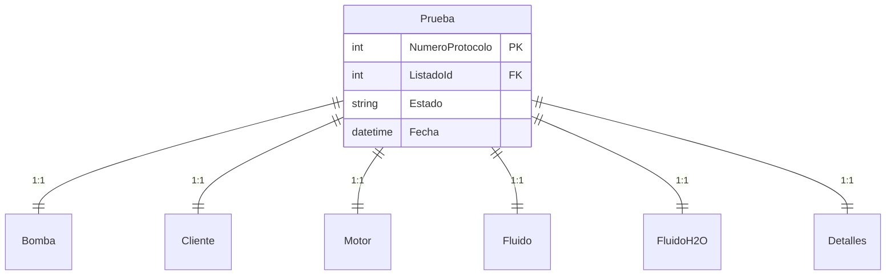

# Mapeo de Campos de Protocolo (Backend <-> Frontend)

Este documento detalla la relación entre los campos del Frontend (Supervisor App), los DTOs de transferencia y las Entidades de Base de Datos (Backend), centrándose en los datos asociados al `NumeroProtocolo`.

> **Nota:** Se han excluido los parámetros de series temporales (`PruebaParametro`, `PruebaParametroValor`), centrándose en las especificaciones y puntos nominales/garantizados.

## 1. Información General (`Prueba` / `Cliente` / `Bomba`)

| Frontend Field (DTO: `generalInfo`) | Backend Entity -> Property    | Database Column                  | Notes                                                                                                                                                                                     |
| :---------------------------------- | :---------------------------- | :------------------------------- | :---------------------------------------------------------------------------------------------------------------------------------------------------------------------------------------- |
| `pedido`                            | `Prueba.Listado.Pedido`\*     | `ListadoProduccion.Pedido`       | El valor inicial viene del Listado. En `PatchTest` no se actualiza directamente en `Prueba` sino que se usa para crear referencias.                                                       |
| `cliente`                           | `Cliente.Nombre`              | `Cliente.Nombre`                 | Linked via `NumeroProtocolo`.                                                                                                                                                             |
| `pedidoCliente`                     | `Cliente.PedidoCliente`       | `Cliente.PedidoCliente`          |                                                                                                                                                                                           |
| `modeloBomba`                       | `Bomba.Tipo`                  | `Bomba.Tipo`                     | En DTO es `modeloBomba`, en BD es `Tipo`.                                                                                                                                                 |
| `ordenTrabajo`                      | `Bomba.OrdenDeTrabajo`        | `Bomba.OrdenDeTrabajo`           | Formato `OT-Suffix` (e.g., `9000-01`).                                                                                                                                                    |
| `numeroBombas`                      | `Prueba.Listado.NumeroBombas` | `ListadoProduccion.NumeroBombas` | Read-only from Listado reference.                                                                                                                                                         |
| `fecha`                             | `Prueba.Fecha`                | `Prueba.Fecha`                   |                                                                                                                                                                                           |
| `item`                              | `Bomba.Item`                  | `Bomba.Item`                     | Prioridad en Frontend.                                                                                                                                                                    |
| `posicion`                          | N/A                           | N/A                              | Campo presente en DTO `TestGeneralInfo` pero no parece persistirse explícitamente en una columna dedicada de `Prueba` o `Bomba` en el `PatchTest` actual, salvo que se use auxiliarmente. |

## 2. Datos de Bomba (`Bomba`)

| Frontend Field (DTO: `pdfData`) | Backend Entity -> Property | Database Column            | Notes                                            |
| :------------------------------ | :------------------------- | :------------------------- | :----------------------------------------------- |
| `item`                          | `Bomba.Item`               | `Bomba.Item`               | Redundante con General Info, pero editable aquí. |
| `modeloBomba`                   | `Bomba.Tipo`               | `Bomba.Tipo`               |                                                  |
| `suctionDiameter`               | `Bomba.DiametroAspiracion` | `Bomba.DiametroAspiracion` | `float`                                          |
| `dischargeDiameter`             | `Bomba.DiametroImpulsion`  | `Bomba.DiametroImpulsion`  | `float`                                          |
| `impellerDiameter`              | `Bomba.DiametroRodete`     | `Bomba.DiametroRodete`     | `string`                                         |
| `sealType`                      | `Bomba.TipoCierre`         | `Bomba.TipoCierre`         |                                                  |
| `vertical`                      | `Bomba.Vertical`           | `Bomba.Vertical`           | `bool`                                           |

## 3. Punto Garantizado Agua (`FluidoH2O`)

Datos del punto nominal/garantizado en agua.

| Frontend Field (DTO: `pdfData`) | Backend Entity -> Property | Database Column           | Notes |
| :------------------------------ | :------------------------- | :------------------------ | :---- |
| `flowRate`                      | `FluidoH2O.Caudal`         | `FluidoH2O.Caudal`        |       |
| `head`                          | `FluidoH2O.Altura`         | `FluidoH2O.Altura`        |       |
| `rpm`                           | `FluidoH2O.Velocidad`      | `FluidoH2O.Velocidad`     |       |
| `maxPower`                      | `FluidoH2O.Potencia`       | `FluidoH2O.Potencia`      |       |
| `efficiency`                    | `FluidoH2O.Rendimiento`    | `FluidoH2O.Rendimiento`   |       |
| `npshr`                         | `FluidoH2O.NPSHRequerido`  | `FluidoH2O.NPSHRequerido` |       |

## 4. Fluido / Punto Garantizado Viscoso (`Fluido`)

Datos del fluido de proceso y su punto garantizado si aplica.

| Frontend Field (DTO: `pdfData`) | Backend Entity -> Property      | Database Column                 | Notes |
| :------------------------------ | :------------------------------ | :------------------------------ | :---- |
| `liquidDescription`             | `Fluido.Nombre`                 | `Fluido.Nombre`                 |       |
| `temperature`                   | `Fluido.Temperatura`            | `Fluido.Temperatura`            |       |
| `viscosity`                     | `Fluido.Viscosidad`             | `Fluido.Viscosidad`             |       |
| `density`                       | `Fluido.Densidad`               | `Fluido.Densidad`               |       |
| `fluidFlowRate`                 | `Fluido.Caudal`                 | `Fluido.Caudal`                 |       |
| `fluidHead`                     | `Fluido.Altura`                 | `Fluido.Altura`                 |       |
| `fluidRpm`                      | `Fluido.Velocidad`              | `Fluido.Velocidad`              |       |
| `fluidPower`                    | `Fluido.Potencia`               | `Fluido.Potencia`               |       |
| `fluidEfficiency`               | `Fluido.Rendimiento`            | `Fluido.Rendimiento`            |       |
| `cq`                            | `Fluido.CaudalCoeficiente`      | `Fluido.CaudalCoeficiente`      |       |
| `ch`                            | `Fluido.AlturaCoeficiente`      | `Fluido.AlturaCoeficiente`      |       |
| `ce`                            | `Fluido.RendimientoCoeficiente` | `Fluido.RendimientoCoeficiente` |       |

## 5. Datos Motor (`Motor`)

| Frontend Field (DTO: `pdfData`) | Backend Entity -> Property | Database Column        | Notes |
| :------------------------------ | :------------------------- | :--------------------- | :---- |
| `motorMarca`                    | `Motor.Marca`              | `Motor.Marca`          |       |
| `motorTipo`                     | `Motor.Tipo`               | `Motor.Tipo`           |       |
| `motorPotencia`                 | `Motor.Potencia`           | `Motor.Potencia`       |       |
| `motorVelocidad`                | `Motor.Velocidad`          | `Motor.Velocidad`      |       |
| `motorIntensidad`               | `Motor.Intensidad`         | `Motor.Intensidad`     |       |
| `motorRendimiento25`            | `Motor.Rendimiento25`      | `Motor.Rendimiento25`  |       |
| `motorRendimiento50`            | `Motor.Rendimiento50`      | `Motor.Rendimiento50`  |       |
| `motorRendimiento75`            | `Motor.Rendimiento75`      | `Motor.Rendimiento75`  |       |
| `motorRendimiento100`           | `Motor.Rendimiento100`     | `Motor.Rendimiento100` |       |
| `motorRendimiento125`           | `Motor.Rendimiento125`     | `Motor.Rendimiento125` |       |

## 6. Detalles / Comentarios (`Detalles`)

| Frontend Field (DTO: `pdfData`)       | Backend Entity -> Property             | Database Column                        | Notes                             |
| :------------------------------------ | :------------------------------------- | :------------------------------------- | :-------------------------------- |
| `tolerance`                           | `Detalles.Comentario`                  | `Detalles.Comentario`                  | Used for standard tolerance text. |
| `internalComment`                     | `Detalles.ComentarioInterno`           | `Detalles.ComentarioInterno`           |                                   |
| `detallesCorreccionManometrica`       | `Detalles.CorreccionManometrica`       | `Detalles.CorreccionManometrica`       |                                   |
| `detallesPresionAtmosferica`          | `Detalles.PresionAtmosferica`          | `Detalles.PresionAtmosferica`          |                                   |
| `detallesTemperaturaAgua`             | `Detalles.TemperaturaAgua`             | `Detalles.TemperaturaAgua`             |                                   |
| `detallesTemperaturaAmbiente`         | `Detalles.TemperaturaAmbiente`         | `Detalles.TemperaturaAmbiente`         |                                   |
| `detallesTemperaturaLadoAcoplamiento` | `Detalles.TemperaturaLadoAcoplamiento` | `Detalles.TemperaturaLadoAcoplamiento` |                                   |
| `detallesTemperaturaLadoBomba`        | `Detalles.TemperaturaLadoBomba`        | `Detalles.TemperaturaLadoBomba`        |                                   |
| `detallesTiempoFuncionamientoBomba`   | `Detalles.TiempoFuncionamientoBomba`   | `Detalles.TiempoFuncionamientoBomba`   |                                   |

## Estructura de Claves Foráneas

Todas las entidades secundarias (`Bomba`, `Cliente`, `Motor`, `Fluido`, `FluidoH2O`, `Detalles`) utilizan `NumeroProtocolo` como clave foránea (FK) que referencia a la tabla `Prueba`.

