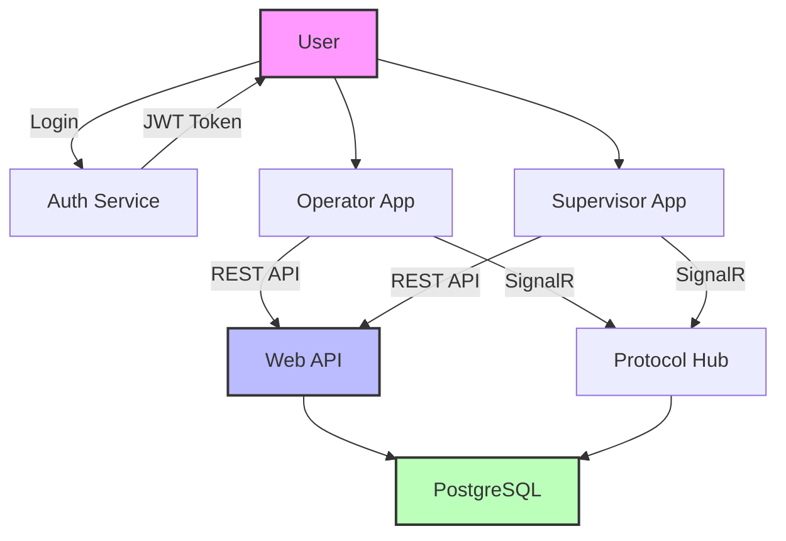
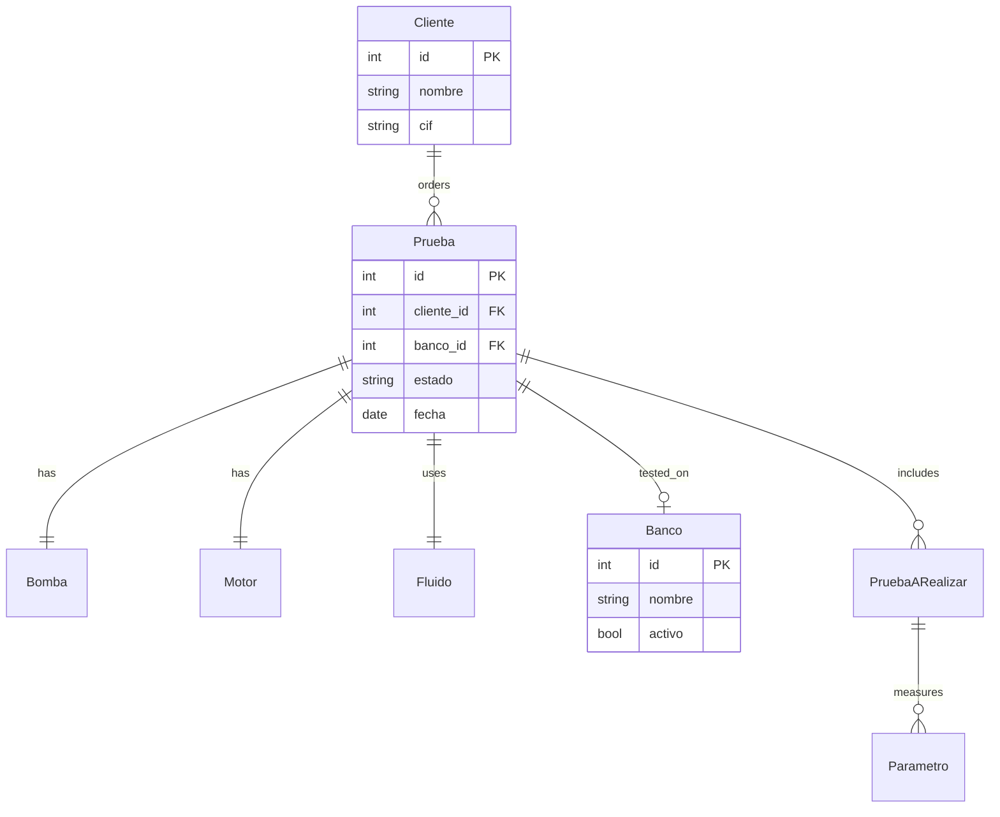
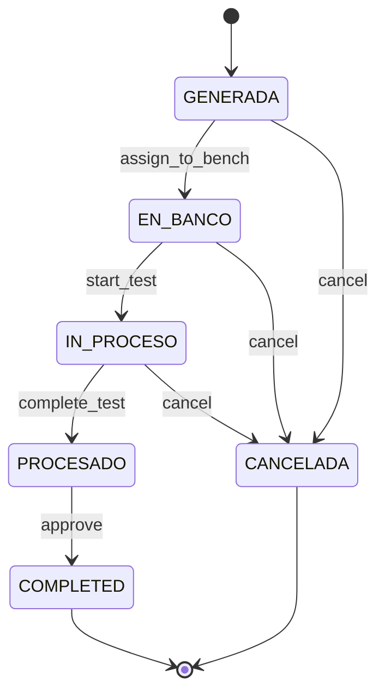

# Architecture Overview

## System Architecture

The PumpIoT system is a full-stack application for managing pump testing operations.

### Technology Stack

- **Frontend**: React + Vite (Operator App), Next.js (Supervisor App)
- **Backend**: ASP.NET Core 9.0 Web API
- **Database**: PostgreSQL
- **Real-time**: SignalR
- **Package Manager**: pnpm with Turborepo

### Application Structure

```
pump-iot-web-prod/
├── apps/
│   ├── operator/       # Operator application (React + Vite)
│   ├── supervisor/    # Supervisor application (Next.js)
│   └── docs/          # Documentation (VitePress)
├── packages/
│   ├── core/          # Shared API utilities
│   └── ui/            # Shared UI components
└── turbo.json         # Turborepo configuration
```

### System Flow Diagram



### Backend Structure

```
pump-iot-dotnet-main/
├── src/
│   ├── PumpIot.Domain/        # Domain entities
│   ├── PumpIot.Application/   # Application services
│   ├── PumpIot.Infrastructure/# Data access & EF Core
│   └── PumpIot.WebAPI/        # REST API + SignalR Hub
└── migrations/                # EF Core migrations
```

### Key Entities

| Entity | Description |
|--------|-------------|
| **Prueba** (Test) | Represents a pump test |
| **Banco** (Bench) | Testing bench (A, B, C, D, E) |
| **Bomba** (Pump) | Pump being tested |
| **Motor** | Motor linked to the pump |
| **Cliente** (Client) | Customer information |
| **Fluido** (Fluid) | Test fluid configuration |

### Entity Relationship Diagram



### Test Status Flow



### Key APIs

| Endpoint | Method | Description |
|----------|--------|-------------|
| `/api/tests` | GET | List all tests |
| `/api/tests` | POST | Create new test |
| `/api/tests/{id}` | GET | Get test details |
| `/api/tests/{id}` | PUT | Update test |
| `/api/bancos` | GET | List benches |
| `/hubs/protocol` | WS | SignalR hub for real-time |
