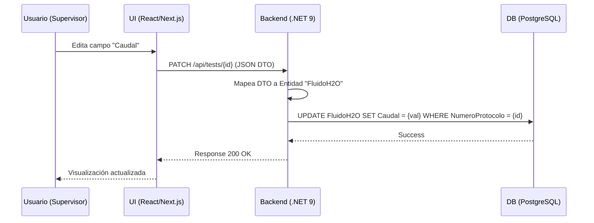
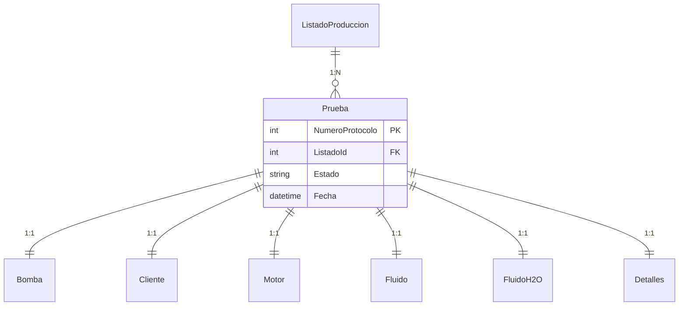

# Database & Frontend Mapping

Este documento describe la relación entre las tablas de la base de datos (Backend), los DTOs de transferencia y los campos visibles en las aplicaciones Frontend (Supervisor y Operador).

## 1. Mapeo General de Entidades

Todas las entidades relacionadas con una prueba técnica están vinculadas por el `NumeroProtocolo`.

| Tabla DB (Backend)  | Entidad C#          | Interface Frontend | Propósito                                   |
| :------------------ | :------------------ | :----------------- | :------------------------------------------ |
| `Prueba`            | `Prueba`            | `Test`             | Entidad central del ensayo.                 |
| `Bomba`             | `Bomba`             | `PumpData`         | Especificaciones técnicas de la bomba.      |
| `Cliente`           | `Cliente`           | `ClientData`       | Información del cliente y pedido.           |
| `Motor`             | `Motor`             | `MotorData`        | Datos del motor eléctrico utilizado.        |
| `Fluido`            | `Fluido`            | `FluidData`        | Propiedades del fluido y punto garantizado. |
| `FluidoH2O`         | `FluidoH2O`         | `H2OData`          | Punto garantizado en agua.                  |
| `Detalles`          | `Detalles`          | `DetailData`       | Mediciones auxiliares y comentarios.        |
| `ListadoProduccion` | `ListadoProduccion` | `Listado`          | Registro de planificación de producción.    |

---

## 2. Detalle de Campos por Sección

### 2.1 Información de Pedido y Cliente

Ubicación: Cabecera de Supervisor / Sección "Datos de Pedido".

| Campo Frontend  | Propiedad C#            | Columna DB                 | Tipo       | Nota                               |
| :-------------- | :---------------------- | :------------------------- | :--------- | :--------------------------------- |
| `pedido`        | `Prueba.Listado.Pedido` | `ListadoProduccion.Pedido` | `string`   | Viene del listado importado.       |
| `cliente`       | `Cliente.Nombre`        | `Cliente.Nombre`           | `string`   | Autocompletado desde BD.           |
| `item`          | `Bomba.Item`            | `Bomba.Item`               | `string`   | Identificador de línea en pedido.  |
| `modeloBomba`   | `Bomba.Tipo`            | `Bomba.Tipo`               | `string`   | Modelo comercial.                  |
| `ordenTrabajo`  | `Bomba.OrdenDeTrabajo`  | `Bomba.OrdenDeTrabajo`     | `string`   | OT interna (ej: 9000-01).          |
| `fecha`         | `Prueba.Fecha`          | `Prueba.Fecha`             | `DateTime` | Fecha de generación del protocolo. |

### 2.2 Especificaciones Técnicas (Bomba)

Ubicación: Pestaña "Datos" -> Sección "Bomba".

| Campo Frontend      | Propiedad C#               | Columna DB           | Tipo     |
| :------------------ | :------------------------- | :------------------- | :------- |
| `suctionDiameter`   | `Bomba.DiametroAspiracion` | `DiametroAspiracion` | `float`  |
| `dischargeDiameter` | `Bomba.DiametroImpulsion`  | `DiametroImpulsion`  | `float`  |
| `impellerDiameter`  | `Bomba.DiametroRodete`     | `DiametroRodete`     | `string` |
| `sealType`          | `Bomba.TipoCierre`         | `TipoCierre`         | `string` |
| `vertical`          | `Bomba.Vertical`           | `Vertical`           | `bool`   |

### 2.3 Curvas y Puntos Garantizados (Agua)

Ubicación: Pestaña "Datos" -> Sección "Punto Garantizado en Agua".

| Campo Frontend | Propiedad C#              | Columna DB      | Tipo    |
| :------------- | :------------------------ | :-------------- | :------ |
| `flowRate`     | `FluidoH2O.Caudal`        | `Caudal`        | `float` |
| `head`         | `FluidoH2O.Altura`        | `Altura`        | `float` |
| `rpm`          | `FluidoH2O.Velocidad`     | `Velocidad`     | `float` |
| `maxPower`     | `FluidoH2O.Potencia`      | `Potencia`      | `float` |
| `efficiency`   | `FluidoH2O.Rendimiento`   | `Rendimiento`   | `float` |
| `npshr`        | `FluidoH2O.NPSHRequerido` | `NPSHRequerido` | `float` |

### 2.4 Datos del Motor

Ubicación: Pestaña "Datos" -> Sección "Motor".

| Campo Frontend        | Propiedad C#           | Columna DB       | Tipo     |
| :-------------------- | :--------------------- | :--------------- | :------- |
| `motorMarca`          | `Motor.Marca`          | `Marca`          | `string` |
| `motorTipo`           | `Motor.Tipo`           | `Tipo`           | `string` |
| `motorPotencia`       | `Motor.Potencia`       | `Potencia`       | `float`  |
| `motorVelocidad`      | `Motor.Velocidad`      | `Velocidad`      | `float`  |
| `motorIntensidad`     | `Motor.Intensidad`     | `Intensidad`     | `float`  |
| `motorRendimiento100` | `Motor.Rendimiento100` | `Rendimiento100` | `float`  |

### 2.5 Mediciones Auxiliares (Detalles)

Ubicación: Pestaña "Datos" -> Sección "Detalles de Prueba".

| Campo Frontend         | Propiedad C#                  | Columna DB           | Tipo     |
| :--------------------- | :---------------------------- | :------------------- | :------- |
| `detallesPresionAtmos` | `Detalles.PresionAtmosferica` | `PresionAtmosferica` | `float`  |
| `detallesTempAgua`     | `Detalles.TemperaturaAgua`    | `TemperaturaAgua`    | `float`  |
| `internalComment`      | `Detalles.ComentarioInterno`  | `ComentarioInterno`  | `string` |

---

## 3. Flujo de Datos

## 4. Estructura de Claves (ER)

