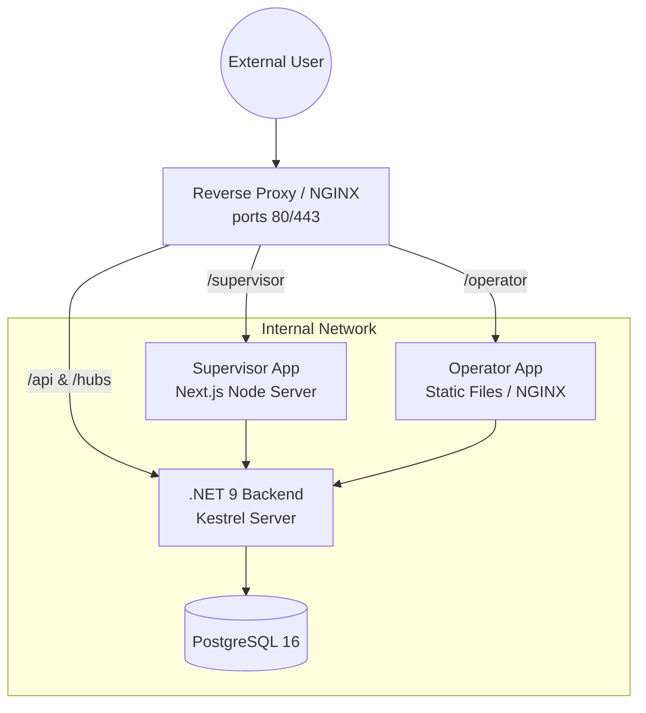

# Deployment Guide

This document outlines the procedures to deploy the full PumpIoT ecosystem (Backend, Supervisor, Operator).

## Environment Architecture

The recommended production deployment involves three distinct services, ideally containerized or running as persistent background managers (PM2/systemd) behind a reverse proxy (e.g., NGINX).



## 1. Database Setup

Ensure PostgreSQL 16+ is installed and running.

1. Create a database named `pumpiot` (or per your config).
2. Create an admin user with permissions over this DB.
3. Apply Entity Framework migrations from the backend project:
   ```bash
   cd pump-iot-dotnet/src/PumpIot.WebAPI
   dotnet ef database update
   ```

## 2. Backend Deployment (.NET 9)

**Prerequisites**: .NET 9 SDK/Runtime.

1. Publish the application:
   ```bash
   dotnet publish src/PumpIot.WebAPI -c Release -o ./publish
   ```
2. Configure `appsettings.Production.json` with the correct Database connection string and JWT secret keys.
3. Run the application via Kestrel:
   ```bash
   dotnet ./publish/PumpIot.WebAPI.dll
   ```
   *(We recommend running this under a Linux systemd service or IIS for Windows).*

## 3. Frontend Deployment (Turborepo)

**Prerequisites**: Node.js 20+, pnpm.

1. Install dependencies at the monorepo root:
   ```bash
   pnpm install
   ```
2. Set Production Environment Variables:
   - For Supervisor (`apps/supervisor/.env.production`):
     ```env
     NEXT_PUBLIC_API_URL=https://your-domain.com
     ```
   - For Operator (`apps/operator/.env.production`):
     ```env
     VITE_API_URL=https://your-domain.com
     ```
3. Build all frontends simultaneously:
   ```bash
   pnpm build
   ```

### 3.1 Supervisor App
The Supervisor folder (`apps/supervisor`) is a Next.js application requiring a Node.js runtime.

```bash
cd apps/supervisor
pnpm start
```

### 3.2 Operator App
The Operator app outputs static files into `apps/operator/dist`. Serve this directory using any capable static server (like an NGINX static block or Apache). Vite constructs it as a single-page application, so you must configure URL rewrites to `index.html`.

## 4. NGINX Reverse Proxy Configuration (Example)

A typical reverse proxy setup to route all three applications under one domain:

```nginx
server {
    listen 80;
    server_name pumpiot.yourdomain.com;

    # Backend API and SignalR Hubs
    location /api/ {
        proxy_pass http://localhost:5002;
        proxy_set_header Host $host;
    }
    location /hubs/ {
        proxy_pass http://localhost:5002;
        proxy_http_version 1.1;
        proxy_set_header Upgrade $http_upgrade;
        proxy_set_header Connection "upgrade";
    }

    # Supervisor App (Next.js Node server)
    location / {
        proxy_pass http://localhost:3000;
        proxy_http_version 1.1;
        proxy_set_header Upgrade $http_upgrade;
        proxy_set_header Connection 'upgrade';
        proxy_set_header Host $host;
    }

    # Operator App (Static Vite build)
    location /operator/ {
        alias /var/www/pump-iot/apps/operator/dist/;
        try_files $uri $uri/ /operator/index.html;
    }
}
```
