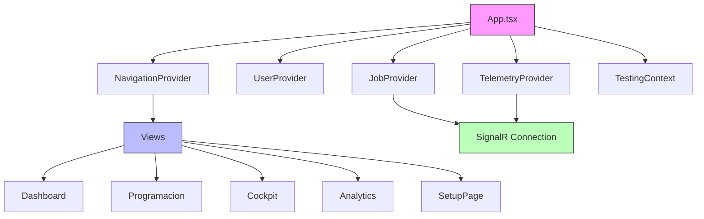
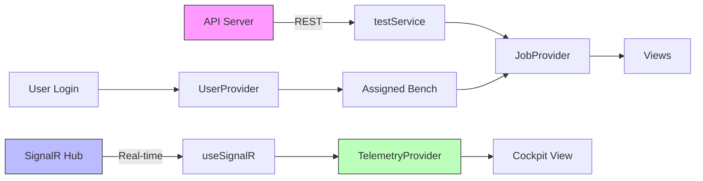
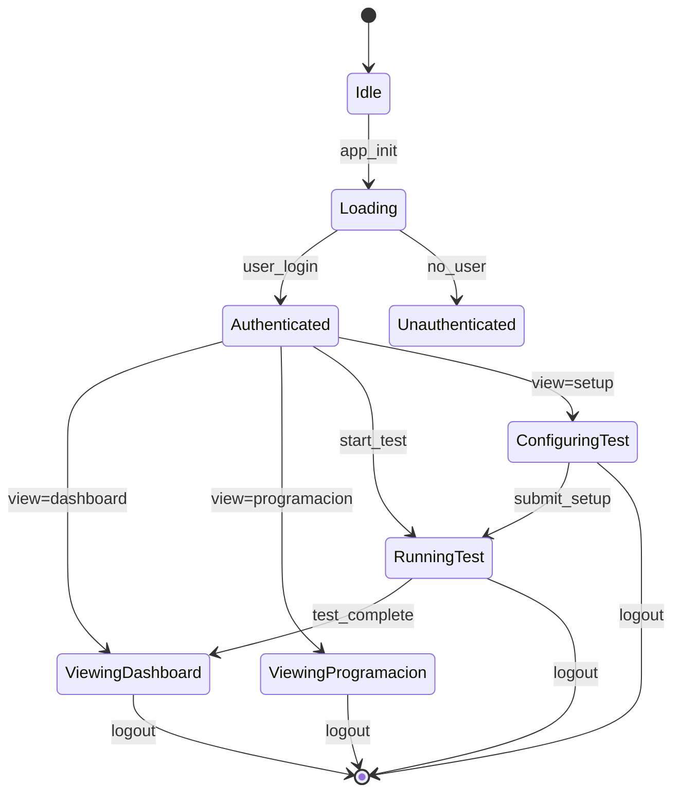
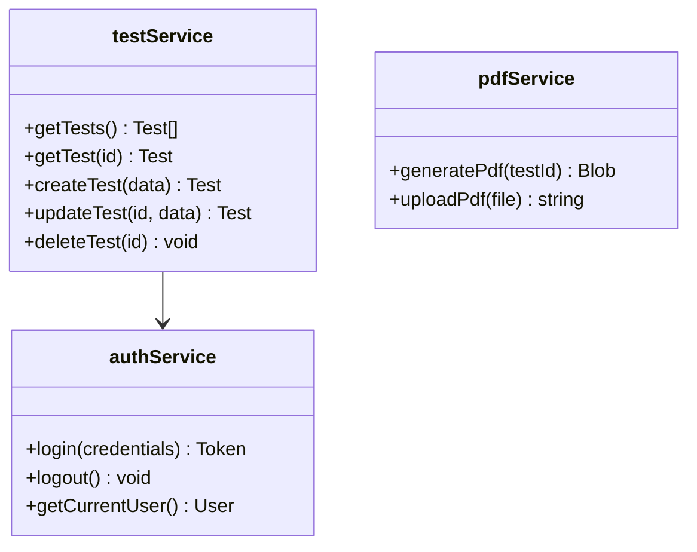
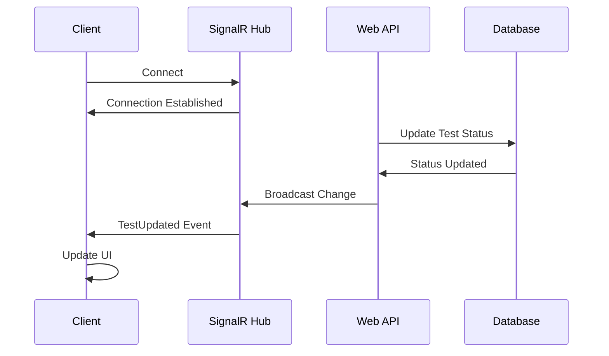
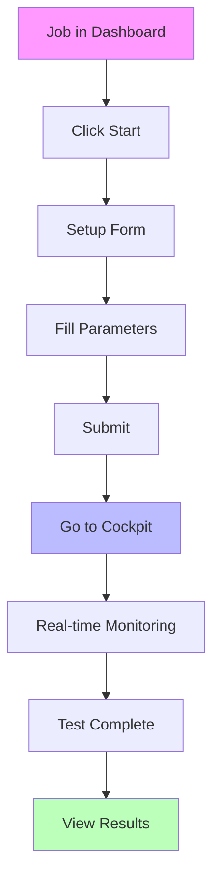
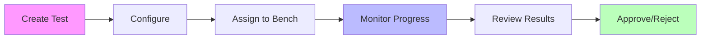

# Frontend Documentation

## Overview

The PumpIoT frontend consists of two main applications in a monorepo using Turborepo:

- **Operator App**: React + Vite application for operators on the factory floor
- **Supervisor App**: Next.js application for supervisors and administrators

Both apps share the `core` and `ui` packages for common functionality.

## Technology Stack

### Operator App
- **Framework**: React 18 with Vite
- **State Management**: React Context API
- **Styling**: Tailwind CSS + shadcn/ui components
- **Real-time**: SignalR client
- **3D Visualization**: Three.js / React Three Fiber

### Supervisor App
- **Framework**: Next.js 14 (App Router)
- **State Management**: React Context + React Query patterns
- **Styling**: Tailwind CSS + shadcn/ui components
- **Real-time**: SignalR client
- **Data Tables**: TanStack Table (React Table)

### Shared Packages
- **@pumpiot/core**: API clients, authentication, types
- **@pumpiot/ui**: Reusable UI components (in development)

## Project Structure

```
pump-iot-web-prod/
├── apps/
│   ├── operator/                 # React + Vite app
│   │   ├── src/
│   │   │   ├── components/       # UI components
│   │   │   ├── contexts/         # React Context providers
│   │   │   ├── features/        # Feature modules
│   │   │   ├── hooks/           # Custom hooks
│   │   │   ├── views/           # Page-level components
│   │   │   └── App.tsx         # Main app component
│   │
│   ├── supervisor/               # Next.js app
│   │   ├── src/
│   │   │   ├── app/             # Next.js App Router pages
│   │   │   ├── components/      # Shared components
│   │   │   ├── features/       # Feature modules
│   │   │   └── lib/            # Utilities
│   │
│   └── docs/                    # VitePress documentation
│
└── packages/
    ├── core/                     # Shared API & types
    └── ui/                      # Shared UI components
```

## Component Architecture

### Operator App Component Hierarchy



### Supervisor App Component Structure

```mermaid
graph LR
    A[App Router] --> B[/supervisor]
    A --> C[/supervisor/programacion]
    A --> D[/supervisor/test/[id]]
    A --> E[/supervisor/user-management]
    
    B --> F[DataTable]
    B --> G[Columns]
    
    C --> H[Kanban Board]
    
    D --> I[TestDetailFeature]
    I --> I1[GeneralInfoSection]
    I --> I2[BombaDataSection]
    I --> I3[MotorDataSection]
    I --> I4[FluidSection]
    I --> I5[DetailsSection]
```

## Data Flow

### Operator App Data Flow



## Context Providers

### Operator Contexts

| Context | Purpose | Key State |
|---------|---------|------------|
| `UserProvider` | User auth & bench assignment | `user`, `assignedBank` |
| `JobProvider` | Test jobs management | `jobs`, `loading`, `error` |
| `NavigationProvider` | View-based navigation | `currentView`, `params` |
| `TestingContext` | Active test state | `currentTest`, `status` |
| `TelemetryProvider` | Real-time telemetry | `telemetryData`, `connected` |

### Context Flow Diagram



## Views & Pages

### Operator Views

| View | File | Description |
|------|------|-------------|
| Dashboard | `views/Dashboard.tsx` | Main dashboard with job list |
| Programacion | `views/Programacion.tsx` | Kanban board by bench |
| Cockpit | `views/Cockpit.tsx` | Real-time test monitoring with 3D |
| Analytics | `views/Analytics.tsx` | Test analytics and charts |
| SetupPage | `views/SetupPage.tsx` | Test configuration form |

### Supervisor Pages

| Path | Page | Description |
|------|------|-------------|
| `/login` | Login | User authentication |
| `/supervisor` | Dashboard | Main test management table |
| `/supervisor/programacion` | Schedule | Kanban board for scheduling |
| `/supervisor/test/[id]` | Test Detail | Full test configuration |
| `/supervisor/user-management` | Users | User administration |

## API Integration

### Core Package Services



### SignalR Integration



## Development Workflow

### Running the Apps

```bash
# Install dependencies
cd pump-iot-web-prod
pnpm install

# Run all apps
pnpm dev

# Run specific app
cd apps/operator && pnpm dev
cd apps/supervisor && pnpm dev

# Run documentation
pnpm docs:dev
```

### Environment Variables

```env
# Operator App (.env)
VITE_API_URL=http://localhost:5000

# Supervisor App (.env.local)
NEXT_PUBLIC_API_URL=http://localhost:5000
```

## Testing Workflow

### Operator Test Flow



### Supervisor Workflow



## Common Issues & Solutions

### SignalR Connection Issues
- **Symptom**: Real-time updates not working
- **Solutions**:
  1. Ensure backend SignalR hub is running
  2. Check CORS configuration in backend
  3. Verify authentication token is passed
  4. Check browser console for connection errors

### Context State Not Updating
- **Symptom**: UI doesn't reflect data changes
- **Solutions**:
  1. Check proper Context provider nesting in App.tsx
  2. Verify state immutability in reducers
  3. Use React DevTools to debug context values
  4. Ensure proper use of useContext hooks

### Build Errors
- **Symptom**: Production build fails
- **Solutions**:
  1. Clear `.vite` or `.next` folders
  2. Delete `node_modules` and reinstall
  3. Check TypeScript errors in editor
  4. Verify environment variables are set
