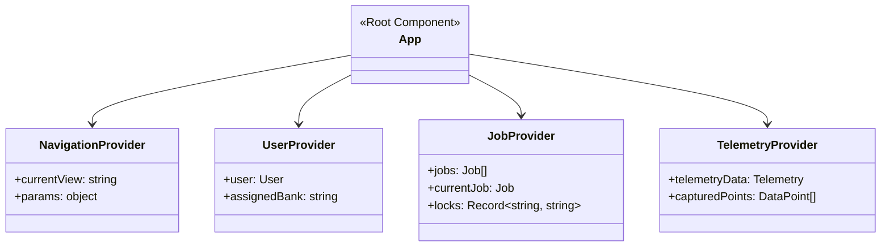
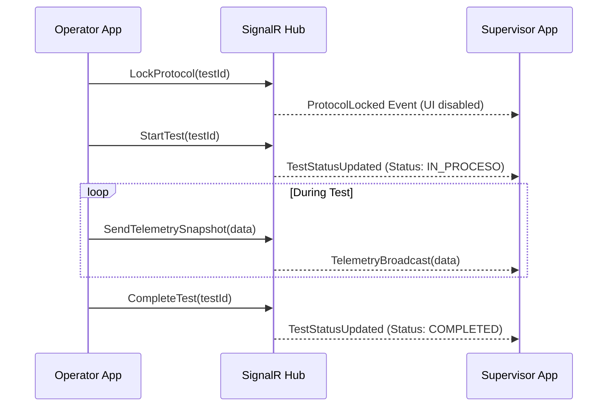

# Operator Application

The Operator application is a React-based single-page application (SPA) built with Vite. It is designed for use on the factory floor, primarily on tablets, to manage and execute pump testing procedures.

## Core Responsibilities

1. **Viewing Scheduled Tests**: Operators can see the tests assigned to their specific test bench.
2. **Test Configuration**: Setting up the test parameters before starting the physical test.
3. **Execution & Monitoring (Cockpit)**: Real-time monitoring of telemetry data (pressure, flow, vibrations, temperatures) alongside a 3D visualization of the pump.
4. **Data Analytics**: Reviewing historical test data and generated charts.

## Key Views

### 1. Dashboard (`views/Dashboard.tsx`)
The entry point of the application. It displays a grid of assigned testing jobs categorized into "Pending" and "History".
- **Features**: Search bar, date range filter, real-time SignalR connection status indicator.
- **Interactions**: Operators can select a pending job to configure it or select a completed job to view its PDF report and analytical data.

### 2. Schedule / Kanban (`views/Programacion.tsx`)
A Kanban board visualizing tests organized by test benches (e.g., Banco A, Banco B). This gives the operator a quick overview of the current workload across the testing facility.

### 3. Setup Page (`views/SetupPage.tsx`)
Before starting a test, the operator must confirm or modify the test parameters.
- **Sections**: Pump details, Motor details, Fluid details, and the specific test points configuration (e.g., taking samples at 100%, 75%, 50% flow).

### 4. Cockpit (`views/Cockpit.tsx`)
The most critical view for active testing.
- **3D Visualization**: Uses React Three Fiber to display a live 3D model of the pump, which reacts to telemetry data strings (e.g., showing rotational speed or vibration alerts).
- **Telemetry Dashboard**: Displays real-time charts and gauge readings (Pressure, Flow, Temperature).
- **Control Panel**: Controls for starting/stopping the test and capturing data points.

### 5. Analytics (`views/Analytics.tsx`)
A post-test review screen where operators can analyze the captured data points plotted on standard pump performance curves (e.g., Head vs. Flow, Efficiency vs. Flow, Power vs. Flow).

## State Management

The application relies on a combination of React Contexts for global state management to ensure different modules remain decoupled but can share critical data.

### Context Breakdown
- **`NavigationProvider`**: Handles internal SPA routing (switching between Dashboard, Cockpit, etc.) without relying on URL-based routing like React Router to keep the UI fluid and app-like on tablets.
- **`UserProvider`**: Manages the authenticated operator's session and the test bench they are currently commanding.
- **`JobProvider`**: Fetches and caches the test jobs assigned to the bench. It also manages the SignalR locks (ensuring two operators cannot run the same test simultaneously).
- **`TelemetryProvider`**: Connects to the real-time data stream when a test is active, distributing the sensor data to the UI components and the 3D model.

## Real-time Communication (SignalR)

The Operator application acts as a critical node in the real-time ecosystem. It subscribes to the `.NET SignalR Protocol Hub` to:
1. Receive notifications when a Supervisor creates a new test.
2. Broadcast its locking status (claiming a test prevents a Supervisor from editing the parameters).
3. Send live test progress back to the Supervisor dashboard in real-time.

