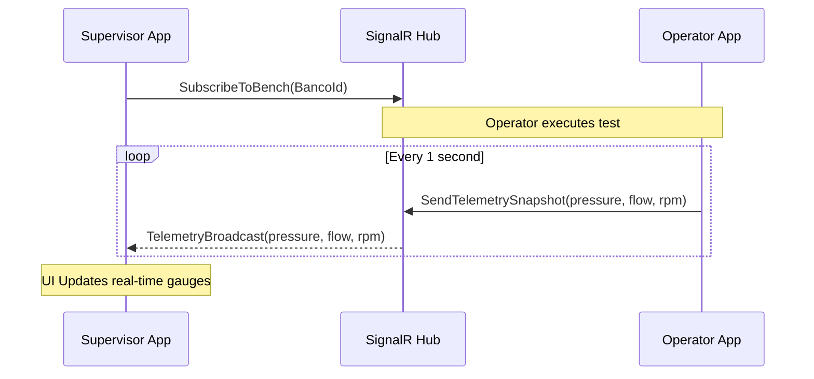

# Supervisor Application

The Supervisor application is a Next.js 14 (App Router) web portal designed for administrators, laboratory supervisors, and engineering staff. It provides full oversight of the pump testing ecosystem, from job creation to final report generation.

## Core Responsibilities

1. **Test Management**: Creating, editing, and managing pump testing protocols and parameters.
2. **Scheduling**: Assigning specific tests to certain test benches (Banco A, B, C...) using a Kanban board.
3. **Data Administration**: Managing master data for pumps (bomba), motors (motor), testing fluids (fluido), and client information.
4. **Live Monitoring**: Observing tests currently in progress across all benches.
5. **Reporting**: Generating, storing, and reviewing the mathematical analysis and final PDF reports for testing protocols.

## Key Features & Pages

### 1. Dashboard (`/supervisor`)
A comprehensive status overview and main data table displaying all tests in the system.
- Includes quick filters for status (Pending, In Bench, In Progress, Completed).
- Features sorting and bulk actions.

### 2. Test Details (`/supervisor/test/[id]`)
An advanced form for configuring all technical parameters of a test before it goes to the bench.
- **Tabs**: General Info, Pump Data, Motor Data, Fluid, Operational Details.
- **Guaranteed Points**: Configurable performance guarantees for the pump that the operator must test against.
- **Results Viewer**: Displays actual captured points against theoretical curves once the test is completed.

### 3. Scheduling Board (`/supervisor/programacion`)
A drag-and-drop Kanban interface for workload management.
- Visualizes test queues for each test bench.
- Supervisors can prioritize jobs by dragging them top to bottom or reassign them by dragging across columns.

### 4. User Management (`/supervisor/user-management`)
Administrative interface to manage operator credentials, roles, and assignments.

## Architecture

The Supervisor application follows a Server-Side Rendering (SSR) approach blended with Client Components for high interactivity dashboards.

```mermaid
graph TD
    A[User Browser]
    
    subgraph Next.js Middleware
    B[Auth Gatekeeper]
    end
    
    subgraph Server Components (SSR)
    C[Data Fetching]
    D[Page Layouts]
    end
    
    subgraph Client Components
    E[TanStack Table]
    F[Kanban Board]
    G[Forms & Validations]
    end
    
    A --> B
    B --> C
    C --> D
    D --> E
    D --> F
    D --> G
    
    subgraph Services
    H[REST API]
    I[SignalR Hub]
    end
    
    C --> H
    E -.-> H
    G -.-> H
    E -.-> I
```

## Security & Middleware

To comply with high industrial security standards, the Supervisor application utilizes an edge middleware (`middleware.ts`).

1. **Zero Trust**: Every request to a `/supervisor/*` route is intercepted by the middleware.
2. **Backend Validation**: The stored JWT token is validated against the `/api/auth/verify` endpoint on the .NET API.
3. **Fail-Safe**: If the API is unreachable or the token has expired, access is blocked and the user is redirected to the login screen.

## Real-time Test Observation

While an Operator is running a test, the Supervisor app can subscribe to the same `.NET SignalR Protocol Hub` to observe the data streaming in real-time.



## PDF Report Generation

Once a test status transitions to `COMPLETED`, the Supervisor triggers the final report generation. The app calls the backend to compose the analytical data into a PDF structure, then stores the reference locally or in blob storage.
