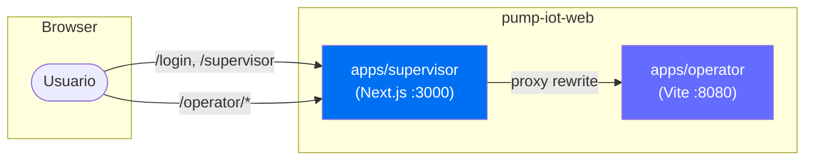

# Arquitectura del Proyecto - Pump IoT Platform

**Versión**: 2.0  
**Fecha**: 22 Enero 2026  
**Estructura**: Monorepo (PNPM Workspaces + Turbo)

---

## 1. Resumen Ejecutivo

Plataforma industrial para pruebas de bombas hidráulicas. Arquitectura **monorepo** con dos aplicaciones frontend independientes servidas bajo un mismo dominio.

### Stack Tecnológico

| Tecnología | Versión | Propósito |
|------------|---------|-----------|
| **PNPM** | 9.x | Package Manager + Workspaces |
| **Turbo** | 2.x | Build System / Dev orchestration |
| **Next.js** | 16.1.1 | Supervisor App (SSR) |
| **Vite** | 6.x | Operator App (SPA) |
| **React** | 19.x | UI Library |
| **TypeScript** | 5.x | Tipado estático |
| **Tailwind CSS** | 4.x | Utilidades CSS |
| **Shadcn UI** | latest | Componentes UI |

---

## 2. Estructura del Monorepo

```text
pump-iot-web/                    # Raíz del monorepo
├── apps/
│   ├── supervisor/              # 🖥️ Next.js (Dashboard/Gestión)
│   │   ├── src/
│   │   │   ├── app/             # App Router
│   │   │   ├── components/      # UI Components
│   │   │   ├── lib/
│   │   │   │   ├── api.ts       # ✅ Centralized API client
│   │   │   │   └── schemas.ts   # Zod validation
│   │   │   └── hooks/
│   │   ├── middleware.ts        # ✅ Server-side auth (NEW)
│   │   └── public/docs/         # Documentation portal
│   │
│   └── operator/                # 🔧 Vite (Testing Cockpit)
│       └── src/
│           ├── contexts/        # ✅ Isolated Providers (NEW)
│           │   ├── NavigationProvider.tsx
│           │   ├── JobProvider.tsx
│           │   ├── TelemetryProvider.tsx
│           │   └── index.ts
│           ├── hooks/
│           │   └── useCaptureLogic.ts  # ✅ Extracted logic (NEW)
│           ├── features/        # ✅ Feature-Based Structure (NEW)
│           │   ├── testing/
│           │   ├── jobs/
│           │   ├── analytics/
│           │   └── index.ts
│           ├── views/           # Main view components
│           └── components/      # Shared UI
│
├── docs/                        # Technical documentation
├── pnpm-workspace.yaml          # Workspace config
├── turbo.json                   # Turbo pipeline
└── package.json                 # Root scripts
```

---

## 3. Integración de Aplicaciones



### Mecanismo de Proxy
- Next.js sirve en `localhost:3000`
- Vite sirve en `localhost:8080` con `base: "/operator/"`
- Next.js `rewrites` redirige `/operator/**` → Vite

---

## 4. Arquitectura SOLID Aplicada

### Antes vs Después (Operator App)

| Aspecto | Antes | Después |
|---------|-------|---------|
| **Contextos** | 1 "God Object" (TestingContext) | 3 providers especializados |
| **Re-renders** | 2/s en toda la app | 0/s fuera del cockpit |
| **Business Logic** | Mezclada en componentes | Hooks dedicados (`useCaptureLogic`) |
| **Imports** | Directos a archivos | Features con public API |

### Provider Composition

```tsx
// apps/operator/src/pages/Index.tsx
<NavigationProvider>        {/* Vista actual */}
  <JobProvider>             {/* Trabajo seleccionado */}
    <TelemetryProvider>     {/* Datos 500ms (aislado) */}
      <AppContent />
    </TelemetryProvider>
  </JobProvider>
</NavigationProvider>
```

---

## 5. Supervisor App - Capas

```mermaid
graph TB
    subgraph PRESENTATION["🎨 Presentación"]
        PAGES["Pages (App Router)"]
        LAYOUTS["Layouts"]
        COMPONENTS["Components"]
    end

    subgraph LOGIC["⚙️ Lógica"]
        MIDDLEWARE["middleware.ts\n(Auth server-side)"]
        SCHEMAS["Zod Schemas"]
        HOOKS["Custom Hooks"]
    end

    subgraph DATA["📡 Datos"]
        API["lib/api.ts\ngetTests(), login()"]
        STORAGE["Cookies + LocalStorage"]
    end

    subgraph EXTERNAL["🌐 Externo"]
        BACKEND["Backend :4000"]
    end

    PAGES --> MIDDLEWARE
    PAGES --> API
    API --> BACKEND
```



### Optimizaciones Aplicadas

| Regla Vercel | Implementación |
|--------------|----------------|
| `bundle-dynamic-imports` | `ImportModal` cargado con `next/dynamic` |
| `rerender-memo` | `useMemo` para columnas y filtros |
| `rendering-hydration-no-flicker` | `middleware.ts` para auth |

---

## 6. Operator App - Features

```mermaid
graph LR
    subgraph FEATURES["src/features/"]
        JOBS["jobs/\n• Dashboard\n• SetupModal"]
        TESTING["testing/\n• Cockpit\n• useCaptureLogic"]
        ANALYTICS["analytics/\n• Analytics"]
    end

    subgraph SHARED["Shared"]
        CONTEXTS["contexts/"]
        COMPONENTS["components/ui/"]
    end

    JOBS --> SHARED
    TESTING --> SHARED
    ANALYTICS --> SHARED
```



### Feature Public API Pattern

```typescript
// features/testing/index.ts
export { Cockpit } from '../../../views/Cockpit';
export { useCaptureLogic } from './hooks/useCaptureLogic';
export { TelemetryProvider, useTelemetry } from '../../../contexts/TelemetryProvider';
```

---

## 7. Decisiones Arquitectónicas

### ¿Por qué Monorepo?
- **Desarrollo unificado**: `pnpm dev` levanta ambas apps
- **Compartir código**: Futuro `packages/shared` para utilidades
- **Despliegue independiente**: Cada app puede desplegarse por separado

### ¿Por qué Vite para Operator?
- **React Three Fiber**: Mejor compatibilidad con Vite
- **SPA pura**: No necesita SSR
- **HMR más rápido**: Ideal para desarrollo de UI 3D

### ¿Por qué Next.js para Supervisor?
- **SEO/SSR**: Posible portal público en futuro
- **Middleware**: Auth server-side nativo
- **API Routes**: Posible BFF (Backend for Frontend)

---

## 8. Comandos de Desarrollo

```bash
# Desarrollo (ambas apps en paralelo)
pnpm dev

# Build producción
pnpm build

# Solo Supervisor
pnpm --filter @pump-iot/supervisor dev

# Solo Operator
pnpm --filter @pump-iot/operator dev
```

---

## 9. Sistema de Build y Resiliencia Air-Gapped

La implementación de **Turbo** es crítica para garantizar la operación en entornos industriales sin conexión a internet (Air-Gapped).

### Beneficios Clave
1.  **Caché Local Persistente**: Turbo almacena los artefactos de compilación en `node_modules/.cache/turbo`. Esto significa que si el sistema se reinicia, no es necesario recompilar todo desde cero.
2.  **Zero Network Dependencies**: Una vez instaladas las dependencias (pnpm), el proceso de build es 100% offline. No requiere llamadas a servidores de vercel, npm registry, ni validaciones externas.
3.  **Recuperación Rápida**: En caso de fallo de un contenedor o servicio, el rebuild tarda milisegundos ("Full Turbo") para los componentes que no han cambiado, minimizando el tiempo de inactividad (Downtime).

### Flujo de Recuperación

```mermaid
sequenceDiagram
    participant S as Sistema
    participant T as Turbo Cache
    participant B as Build Process
    
    Note over S: Caída del servicio
    S->>B: Trigger Restart (pnpm dev/build)
    B->>T: ¿Hash de archivos cambiado?
    alt Sin cambios (99% casos)
        T-->>B: HIT (Recuperar de disco)
        B-->>S: Ready en \u003c 1s 🚀
    else Código modificado
        T-->>B: MISS
        B->>B: Recompilar solo diff
        B-->>S: Ready en ~5s
    end
```



---

## 10. Análisis Exhaustivo de Dependencias y Gobierno TI

Este reporte detalla la cadena de suministro de software (Software Supply Chain), identificando el respaldo corporativo y la viabilidad a largo plazo de cada tecnología crítica utilizada en el monorepo.

### 10.1 Infraestructura Crítica (Core)

| Tecnología | Paquete | Backing / Empresa | Uso en Proyecto | Estado & Longevidad |
|------------|---------|-------------------|-----------------|---------------------|
| **Turbo** | `turbo` | **Vercel** | Sistema de Build | **Estándar Industrial**. Escrito en Rust. Vercel ha levantado $313M+ en financiación, garantizando soporte a largo plazo. |
| **PNPM** | `pnpm` | Comunidad (Zoltan Kochan) | Gestor de Paquetes | **Alta Eficiencia**. Usado por Microsoft (Rush Stack) y ByteDance. Mantiene la estructura `node_modules` estricta. |
| **TypeScript** | `typescript` | **Microsoft** | Lenguaje | **Estándar Empresarial**. Soporte garantizado por Microsoft. Reduce deuda técnica y bugs en producción. |

### 10.2 Apps y Frameworks

| Tecnología | Paquete | Backing / Empresa | Uso en Proyecto | Estado & Longevidad |
|------------|---------|-------------------|-----------------|---------------------|
| **Next.js** | `next` | **Vercel** | Supervisor (App) | **Líder de Mercado** en React Frameworks. Soporte LTS. Ecosistema masivo. |
| **Vite** | `vite` | Comunidad (Evan You) | Operator (Build) | **Estándar de Facto** para herramientas modernas (sustituye a Webpack). Backing de Google Chrome Labs y Open Source. |
| **React** | `react`, `react-dom` | **Meta (Facebook)** | UI Library | **Omnipresente**. Meta lo usa en Facebook/Instagram. Retrocompatibilidad excepcional (v16 a v19). |
| **React Router** | `react-router-dom` | **Shopify** (Remix Team) | Operator (Routing) | Adquirido por Shopify, garantizando recursos ilimitados para su mantenimiento. |

### 10.3 Ecosistema UI (Headless & Componentes)

*El proyecto utiliza una arquitectura "Headless" basada en Radix UI, desacoplando la lógica de los estilos, lo que permite cambiar el diseño visual sin romper la funcionalidad.*

| Tecnología | Paquete | Backing / Empresa | Propósito |
|------------|---------|-------------------|-----------|
| **Radix UI** | `@radix-ui/*` | **WorkOS** | Primitivas de UI accesibles (Dialog, Popover, Switch) que cumplen WCAG 2.1. |
| **Tailwind CSS** | `tailwindcss`, `clsx`, `tailwind-merge` | **Tailwind Labs** | Motor de estilos atómicos. Negocio rentable ($10m+/año), muy bajo riesgo de abandono. |
| **Framer Motion** | `framer-motion` | **Framer** | Librería de animación estándar en React. Usada en producción por Framer.com. |
| **Lucide Icons** | `lucide-react` | Comunidad | Set de iconos SVG moderno y ligero (sucesor de Feather Icons). |
| **CMDK** | `cmdk` | **Vercel** (Paco Coursey) | Componente de "Command Palette" optimizado y accesible. |
| **Sonner** | `sonner` | **Vercel** (Emil Kowalski) | Sistema de notificaciones (Toasts) de alto rendimiento. |
| **Vaul** | `vaul` | **Vercel** (Emil Kowalski) | Componente de Drawer/Sheet nativo para móvil. |

### 10.4 Visualización de Datos y 3D (Gemelo Digital)

| Tecnología | Paquete | Backing / Empresa | Propósito |
|------------|---------|-------------------|-----------|
| **Three.js** | `three` | Comunidad (Mr.doob) | Motor 3D WebGL. La base de todo el 3D en la web desde 2010. |
| **R3F** | `@react-three/fiber`, `@react-three/drei` | **Poimandres** | Integración de Three.js en React. Colectivo open source más importante en gráficos web. |
| **Recharts** | `recharts` | Recharts Group | Gráficos estadísticos (líneas, barras) basados en SVG/D3. Muy estable. |

### 10.5 Gestión de Estado y Formularios

| Tecnología | Paquete | Backing / Empresa | Propósito |
|------------|---------|-------------------|-----------|
| **React Hook Form** | `react-hook-form` | **Beetle** | Gestión de formularios performante (sin re-renders). Estándar actual sobre Formik. |
| **Zod** | `zod` | Colin McDonnell | Validación de esquemas en tiempo de ejecución. |
| **TanStack Query** | `@tanstack/react-query` | **TanStack** (Tanner Linsley) | Gestión de estado asíncrono y caché de servidor. Backing corporativo mediante patrocinadores (Ag Grid, nozzle.io). |
| **TanStack Table** | `@tanstack/react-table` | **TanStack** | Lógica compleja para tablas de datos (ordenación, filtos). |
| **DnD Kit** | `@dnd-kit/*` | Clauderic | Librería moderna y accesible para Drag & Drop. |

### 10.6 Utilidades y Helpers

| Paquete | Propósito | Estatus |
|---------|-----------|---------|
| `date-fns` | Manipulación de fechas (inmutable) | Estándar moderno (vs Moment.js que está legado). |
| `pdfjs-dist` | Renderizado de PDFs | **Mozilla Foundation**. El motor que usa Firefox. |
| `input-otp` | Inputs de código único | Componente ligero y específico. |

---

## 11. Referencias

- [PNPM Workspaces](https://pnpm.io/workspaces)
- [Turbo Monorepos](https://turbo.build/repo/docs)
- [Next.js Rewrites](https://nextjs.org/docs/app/api-reference/next-config-js/rewrites)
- [Vercel React Best Practices](https://vercel.com/blog/how-we-optimized-react)
