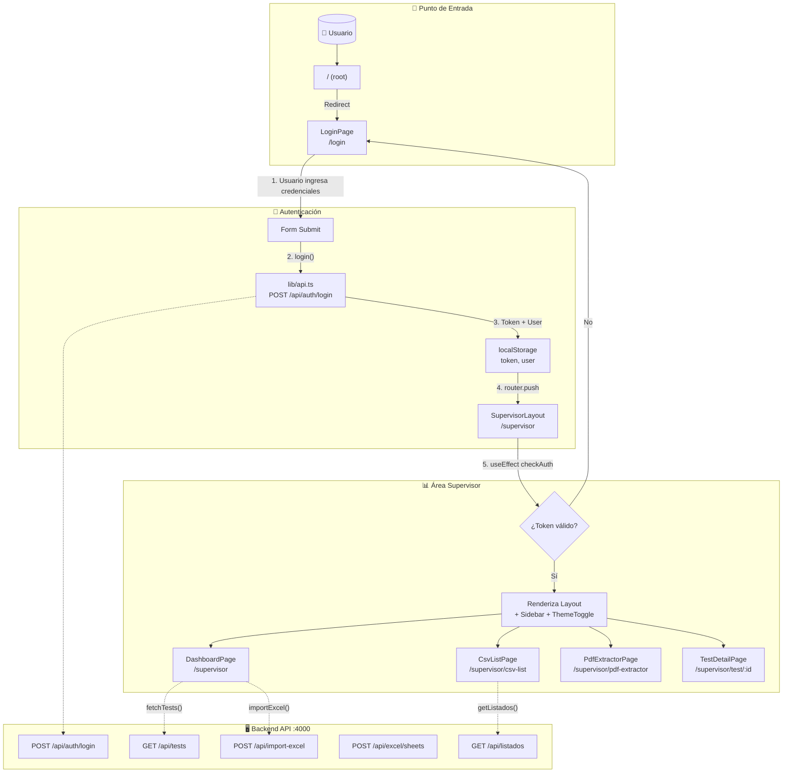
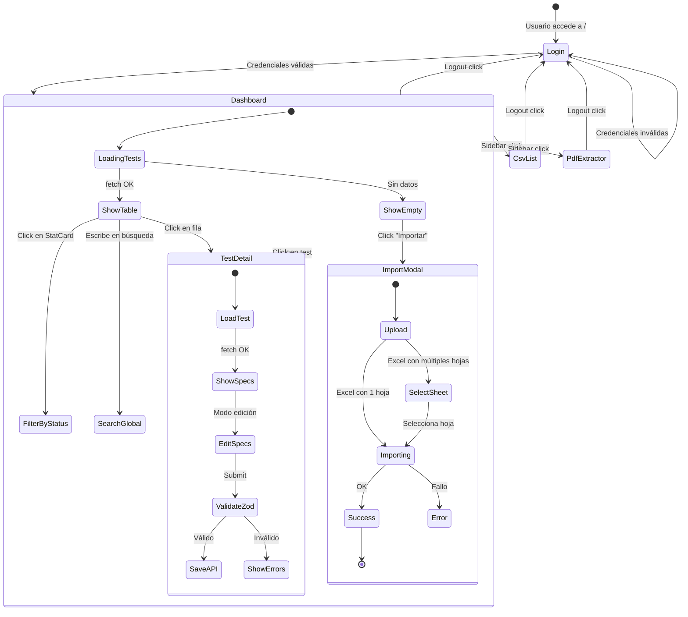
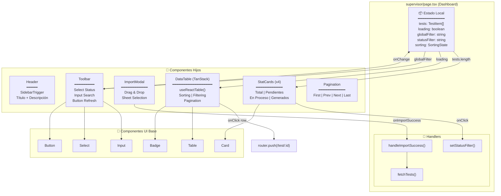
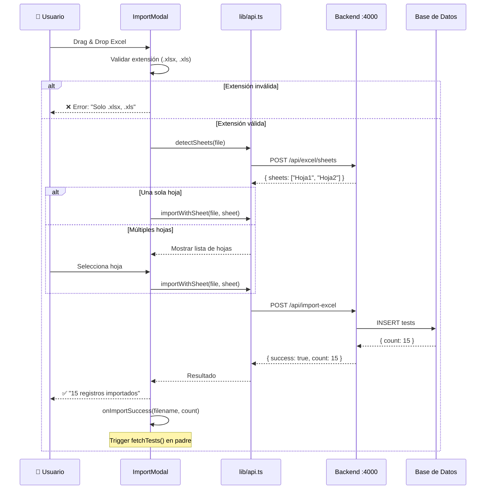
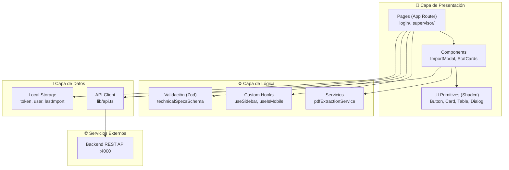

# Informe Técnico de Auditoría y Viabilidad
## Pump IoT Platform - Frontend Repository

**Fecha**: 21 de Enero de 2026  
**Versión del análisis**: 1.1  
**Repositorio auditado**: `pump-iot-web`  

---

## Resumen Ejecutivo

El repositorio representa una **arquitectura de microservicios** donde frontend y backend operan como servicios independientes. El stack (Next.js 16.1.1 + React 19 + TypeScript + Shadcn UI) presenta ventajas significativas para un entorno air-gapped industrial.

> [!IMPORTANT]
> **Hallazgo clave**: No se encontró Prisma en este repositorio porque es exclusivamente frontend. La comunicación se realiza vía API REST hacia un backend separado (puerto 4000), lo cual es **arquitectónicamente correcto** para microservicios.

---

## 1. Análisis de Arquitectura

### 1.1 Estructura del Proyecto

```
pump-iot-web/
├── src/
│   ├── app/                    # App Router de Next.js (rutas)
│   │   ├── login/              # Autenticación
│   │   ├── supervisor/         # Dashboard principal
│   │   │   ├── csv-list/       # Gestión de listados
│   │   │   ├── pdf-extractor/  # Extracción de specs de PDFs
│   │   │   └── test/           # Gestión de pruebas
│   ├── components/
│   │   ├── ui/                 # 22 componentes Shadcn UI
│   │   └── ...                 # Componentes de negocio
│   ├── lib/
│   │   ├── api.ts              # Capa API centralizada
│   │   ├── schemas.ts          # Validaciones Zod
│   │   └── pdfExtractionService.ts
│   └── hooks/                  # Custom hooks
```

### 1.2 Patrón Arquitectónico: Feature-Based + Layered

El proyecto sigue una **arquitectura híbrida**:

| Capa | Responsabilidad | Implementación |
|------|-----------------|----------------|
| **Pages/Routes** | Orquestación de UI y navegación | `src/app/` (Next.js App Router) |
| **Components** | Presentación pura, reutilizables | `src/components/ui/` |
| **Services/Lib** | Lógica de negocio y comunicación | `src/lib/api.ts`, `schemas.ts` |
| **Hooks** | Estado compartido y side effects | `src/hooks/` |

**¿Por qué esta arquitectura?**
- **Escalabilidad**: Cada feature (`supervisor`, `login`) es autocontenida
- **Testabilidad**: La lógica en `lib/` es fácilmente testeable sin UI
- **Onboarding**: Estructura predecible, fácil de navegar

### 1.3 Flujo del Usuario (Journey Map)



### 1.4 Flujo de Navegación Detallado



### 1.5 Comunicación de Componentes (Dashboard)



### 1.6 Flujo de Datos: Importación Excel



### 1.7 Arquitectura de Capas



### 1.5 Adherencia a Clean Code

| Principio | Estado | Evidencia |
|-----------|--------|-----------|
| **Single Responsibility** | ✅ | Cada componente hace una cosa. `ImportModal` solo importa, `api.ts` solo hace HTTP |
| **DRY** | ✅ | Componentes UI reutilizados. `fetchApi` centraliza todas las llamadas |
| **Separation of Concerns** | ✅ | UI en `/components`, lógica en `/lib`, rutas en `/app` |
| **Naming Conventions** | ✅ | Nombres descriptivos: `handleImportSuccess`, `technicalSpecsSchema` |
| **Small Functions** | ✅ | Funciones cortas y enfocadas |
| **Dependency Injection** | ⚠️ | Parcial - API_BASE_URL vía env vars |

---

## 2. Justificación de Dependencias

### 2.1 Dependencias Core y Por Qué Se Eligieron

| Dependencia | Mantenedor | Por Qué Se Eligió | Alternativas Descartadas |
|-------------|------------|-------------------|-------------------------|
| **Next.js 16.1.1** | Vercel (empresa $1.5B+) | SSR/SSG híbrido, App Router moderno, optimización automática | Create React App (sin SSR), Remix (menos maduro) |
| **React 19.2.3** | Meta (Facebook) | Estándar de industria, ecosistema masivo, Server Components | Vue, Svelte (menor ecosistema empresarial) |
| **TypeScript 5** | Microsoft | Tipado estático = menos bugs en runtime, IntelliSense superior | Flow (abandonado), JSDoc (menos potente) |
| **Tailwind CSS 4** | Tailwind Labs | Utility-first = consistencia visual, sin CSS custom | Styled Components (runtime overhead), SASS (más verboso) |

### 2.2 Dependencias UI y Por Qué Se Eligieron

| Dependencia | Mantenedor | Por Qué Se Eligió | Ventaja Clave |
|-------------|------------|-------------------|---------------|
| **Radix UI** | WorkOS (empresa de autenticación) | Primitivos accesibles, sin estilo por defecto | WCAG 2.1 AA compliance out-of-box |
| **Shadcn UI** | Comunidad + shadcn (Vercel employee) | Código fuente local, no librería | 0% vendor lock-in, 100% personalizable |
| **Lucide React** | Comunidad OSS | Fork de Feather Icons, mantenido activamente | Consistente, +1000 iconos, tree-shakeable |
| **TanStack Table** | Tanner Linsley (autor de React Query) | Headless, virtualización, sorting/filtering | La tabla más potente para React |

### 2.3 Dependencias de Validación/Utilidad

| Dependencia | Mantenedor | Por Qué Se Eligió | Uso en el Proyecto |
|-------------|------------|-------------------|-------------------|
| **Zod 4.3.5** | Colin McDonnell (TOSS team) | Schema-first, TypeScript-native, zero deps | Validación de formularios y (futuro) respuestas API |
| **React Hook Form** | Comunidad OSS | Performance (uncontrolled inputs), integración Zod | Formularios de specs técnicas |
| **pdfjs-dist** | Mozilla | Estándar de facto para PDFs en browser | Extracción de datasheets Flowserve |

---

## 3. Zod en Entornos Air-Gapped e IoT Industrial

### 3.1 ¿Por Qué Zod Es Válido?

| Característica | Beneficio para Air-Gap/IoT |
|----------------|---------------------------|
| **Zero dependencies** | No trae código de terceros, todo auditable |
| **TypeScript-first** | Errores capturados en compile-time, no en runtime |
| **No requiere red** | Funciona 100% offline, es código puro de validación |
| **Bundle pequeño** | ~12KB gzipped, no impacta rendimiento en edge |
| **Determinístico** | Misma entrada = misma salida, crítico para sistemas industriales |

### 3.2 Comparación con Alternativas

| Librería | Deps | Bundle Size | Suitable for Air-Gap |
|----------|------|-------------|---------------------|
| **Zod** | 0 | 12 KB | ✅ Ideal |
| Yup | 3 | 25 KB | ⚠️ Aceptable |
| Joi | 5+ | 80 KB | ❌ Demasiado pesado |
| class-validator | 2+ | 40 KB | ⚠️ Requiere reflect-metadata |

### 3.3 Ejemplo: Validación de Specs de Bomba

```typescript
// lib/schemas.ts - Actual en el proyecto
const technicalSpecsSchema = z.object({
    flowRate: z.coerce.number().min(0.1, "Requerido"),  // m³/h
    head: z.coerce.number().min(0.1, "Requerido"),     // metros
    rpm: z.coerce.number().int().min(1, "Requerido"),
    temperature: z.coerce.number().optional(),          // °C
});

// Esto garantiza que datos inválidos NUNCA lleguen al backend
// Si flowRate es "abc", Zod lo captura ANTES de enviar la request
```

---

## 4. Shadcn UI vs Telerik: Análisis para Equipo IT

> [!NOTE]
> La licencia de Telerik ya está pagada. Este análisis se enfoca en **tiempo de migración, soporte técnico, y compatibilidad de navegadores**.

### 4.1 Comparativa Detallada

| Factor | Shadcn UI (Actual) | Telerik Kendo React |
|--------|-------------------|---------------------|
| **Tiempo para replicar UI actual** | N/A (ya está hecho) | **3-6 meses** mínimo |
| **Curva de aprendizaje equipo .NET** | Media (React + TS) | Baja (API similar a WPF) |
| **Soporte técnico** | Comunidad + GitHub Issues | ✅ Tickets con SLA (pagado) |
| **Bugs en navegadores** | Comunidad reporta/fix | ✅ Telerik garantiza fix |
| **Compatibilidad IE11** | ❌ No soportado | ✅ Soportado |
| **Personalización visual** | ✅ 100% (es TU código) | ⚠️ Limitado a themes |
| **Updates de seguridad** | Manual (regenerar componente) | ✅ Automático con suscripción |
| **Documentación** | Excelente (shadcn.com) | Excelente (docs.telerik.com) |

### 4.2 Riesgos de Migrar a Telerik

| Riesgo | Probabilidad | Impacto | Mitigación |
|--------|--------------|---------|-----------|
| Reescribir 22 componentes + páginas | Seguro | 🔴 Alto | N/A - es trabajo garantizado |
| Regresiones visuales vs diseño actual | Alta | 🔴 Alto | QA extensivo |
| La UI NO queda igual de pulida | Media | ⚠️ Medio | Customización intensiva |
| Telerik no soporta React 19 aún | Por verificar | 🔴 Alto | Downgrade a React 18 |
| Tiempo de aprendizaje Kendo API | Seguro | ⚠️ Medio | Capacitación |

### 4.3 Ventajas de Telerik (Ser Objetivos)

1. **Soporte corporativo**: Ticket → respuesta en 24-48h
2. **Compatibilidad garantizada**: Ellos testean en todos los browsers
3. **Componentes complejos listos**: Grids, Charts, Schedulers
4. **Familiaridad .NET**: API similar a WinForms/WPF

### 4.4 Recomendación

> [!IMPORTANT]
> **Mantener Shadcn UI** por las siguientes razones pragmáticas:
> 
> 1. **La UI ya está construida y funciona** - Migrar cuesta 3-6 meses de dev
> 2. **El diseño actual es moderno y pulido** - Replicarlo en Telerik requiere customización intensiva
> 3. **React 19 + Next.js 16** - Telerik puede no soportar esta versión aún
> 4. **El código es 100% auditable** - Crítico para entornos industriales

---

## 5. Gaps Identificados y Estado

### 5.1 Tabla de Issues

| Categoría | Problema | Severidad | Notas |
|-----------|----------|-----------|-------|
| **Seguridad** | JWT en `localStorage` | 💚 **Dev only** | Es código de desarrollo con datos mock, no es issue de producción aún |
| **Seguridad** | PDF Worker desde CDN | 🔴 Alta | **Ver README adjunto** - Requiere fix antes de air-gap |
| **Validación** | Sin validación Zod en respuestas API | ⚠️ Media | Recomendado pero no bloqueante |
| **Logging** | Console.log en lugar de logger estructurado | ⚠️ Media | Añadir pino para producción |
| **Testing** | Sin tests automatizados visibles | ⚠️ Media | Añadir Playwright |

---

## 6. Comparativa Final: Mantener Stack vs Migrar

| Escenario | Esfuerzo | Riesgo | Resultado UI | Tiempo |
|-----------|----------|--------|--------------|--------|
| **Mantener + Mejoras** | Bajo (1-2 semanas) | Bajo | ✅ Idéntico (ya está) | Inmediato |
| **Migrar a Telerik** | Alto (3-6 meses) | Alto | ⚠️ Probablemente diferente | Q2/Q3 2026 |

**Recomendación final**: Mantener el stack actual con las mejoras prioritarias listadas.

---

## Anexos

### Anexo A: Inventario de Componentes Shadcn UI

| Componente | Primitivo Base | Uso Principal |
|------------|----------------|---------------|
| Accordion | Radix Accordion | Secciones colapsables |
| Avatar | Radix Avatar | Header de usuario |
| Badge | Personalizado | Status de tests |
| Button | Radix Slot | CTAs, acciones |
| Card | Personalizado | Contenedores de stats |
| Dialog | Radix Dialog | Modales |
| Dropdown Menu | Radix Dropdown | Menús contextuales |
| Form | React Hook Form | Formularios |
| Input | Personalizado | Campos de texto |
| Select | Radix Select | Selectores |
| Sheet | Radix Dialog | Paneles laterales |
| Sidebar | Personalizado | Navegación principal |
| Table | Personalizado | Listados de datos |
| Tooltip | Radix Tooltip | Ayudas contextuales |

### Anexo B: Comandos de Verificación

```powershell
# Auditoría de seguridad
npm audit --omit=dev

# Build de producción
npm run build

# Verificar TypeScript
npx tsc --noEmit
```

---

**Documento preparado por**: Antigravity AI  
**Versión**: 1.1 - Actualizado con feedback  
