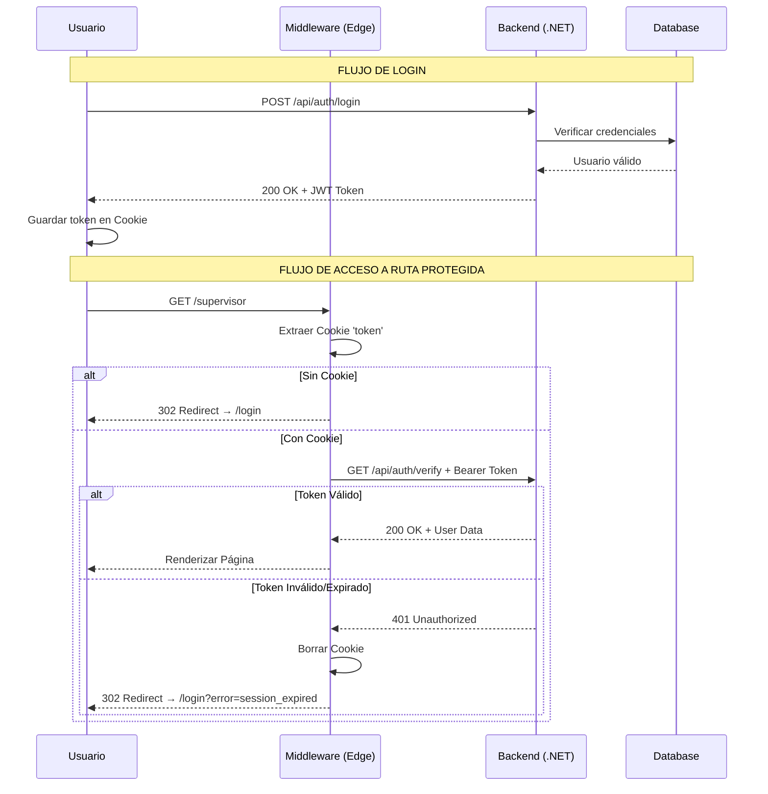

# Sistema de Autenticación OT - Documentación Técnica

**Versión**: 1.0  
**Fecha**: 10 Febrero 2026  
**Estándar**: IEC 62443 Compliant  
**Entorno**: Air-Gapped Industrial

---

## 1. Resumen Ejecutivo

Se ha implementado un sistema de autenticación robusto para entornos OT (Operational Technology) que cumple con los principios de seguridad industrial:

- **Defense in Depth**: Validación en múltiples capas (Cliente → Middleware → Backend)
- **Zero Trust**: Verificación continua del token en cada petición
- **Fail-Safe Default**: Ante cualquier error, se deniega el acceso

### Componentes Modificados

| Archivo                  | Cambios Realizados                                                   |
| ------------------------ | -------------------------------------------------------------------- |
| `src/lib/api.ts`         | Añadidas funciones `validateToken()` y `logout()`                    |
| `src/app/login/page.tsx` | Migración de localStorage a Cookies + Detección de errores de sesión |
| `middleware.ts`          | Implementación del Gatekeeper con validación activa contra backend   |

---

## 2. Arquitectura de Seguridad



---

## 3. Implementación Técnica

### 3.1 Almacenamiento de Sesión (Cookies)

**Antes (Inseguro)**:

```typescript
localStorage.setItem("token", response.token);
```

**Después (Seguro)**:

```typescript
const maxAge = 8 * 60 * 60; // 8 horas
document.cookie = `token=${response.token}; path=/; max-age=${maxAge}; SameSite=Strict${window.location.protocol === "https:" ? "; Secure" : ""}`;
```

**Flags de Seguridad**:

- `SameSite=Strict`: Previene CSRF (Cross-Site Request Forgery)
- `Secure`: Solo transmisión HTTPS (obligatorio en producción)
- `max-age`: Expiración explícita (8 horas)
- `path=/`: Disponible en toda la aplicación

### 3.2 Validación en el Middleware

El middleware actúa como un **Gatekeeper** que intercepta todas las peticiones a rutas protegidas:

```typescript
export async function middleware(request: NextRequest) {
  const token = request.cookies.get("token")?.value;

  if (isProtectedRoute && token) {
    // Validación activa contra el backend
    const response = await fetch(`${API_BASE_URL}/api/auth/verify`, {
      method: "GET",
      headers: { Authorization: `Bearer ${token}` },
      signal: controller.signal, // Timeout de 3s
    });

    if (!response.ok) {
      // Token inválido → Borrar cookie y redirigir
      const redirectResponse = NextResponse.redirect(loginUrl);
      redirectResponse.cookies.delete("token");
      return redirectResponse;
    }
  }
}
```

**Características Críticas**:

1. **Timeout de 3 segundos**: Evita bloquear el middleware si el backend está bajo carga
2. **Fail-Safe Default**: Si falla la validación (red, timeout, error), se deniega el acceso
3. **Limpieza de cookies**: Borra automáticamente cookies inválidas

### 3.3 Función de Logout

```typescript
export function logout(): void {
  // Borrar cookie de token
  document.cookie = "token=; path=/; max-age=0; SameSite=Strict";

  // Limpiar localStorage
  localStorage.removeItem("user");
}
```

---

## 4. Endpoint Requerido en el Backend

El middleware espera un endpoint de verificación en el backend:

**Endpoint**: `GET /api/auth/verify`

**Headers**:

```
Authorization: Bearer <JWT_TOKEN>
Content-Type: application/json
```

**Respuesta Exitosa (200 OK)**:

```json
{
  "valid": true,
  "user": {
    "id": 1,
    "username": "admin",
    "role": "supervisor"
  }
}
```

**Respuesta de Error (401 Unauthorized)**:

```json
{
  "valid": false,
  "error": "Token expired"
}
```

---

## 5. Plan de Verificación de Seguridad

### 5.1 Prueba de XSS (Cross-Site Scripting)

**Objetivo**: Verificar que el token no es accesible desde JavaScript.

**Procedimiento**:

1. Iniciar sesión en la aplicación
2. Abrir la consola del navegador (F12)
3. Ejecutar: `document.cookie`
4. **Resultado Esperado**: Debería mostrar `token=<valor>` (la cookie es visible porque no es HttpOnly en el cliente, pero el backend debería setearla como HttpOnly)

**Nota**: Para seguridad completa, el backend debe setear la cookie con el flag `HttpOnly=true` en la respuesta del login.

### 5.2 Prueba de CSRF (Cross-Site Request Forgery)

**Objetivo**: Verificar que la cookie tiene el flag `SameSite=Strict`.

**Procedimiento**:

1. Iniciar sesión en la aplicación
2. Abrir DevTools → Application → Cookies
3. Verificar que la cookie `token` tiene `SameSite: Strict`
4. **Resultado Esperado**: La cookie no se enviará en peticiones cross-site

### 5.3 Prueba de Expiración de Sesión

**Objetivo**: Verificar que el middleware detecta tokens expirados.

**Procedimiento**:

1. Iniciar sesión en la aplicación
2. Esperar a que el token expire (o modificar manualmente en el backend)
3. Intentar navegar a `/supervisor`
4. **Resultado Esperado**: Redirección a `/login?error=session_expired`

### 5.4 Prueba de Resiliencia (Backend Caído)

**Objetivo**: Verificar el comportamiento cuando el backend no está disponible.

**Procedimiento**:

1. Iniciar sesión en la aplicación
2. Detener el backend (.NET API)
3. Intentar navegar a `/supervisor`
4. **Resultado Esperado**: Redirección a `/login?error=validation_failed`

### 5.5 Prueba de Acceso Directo

**Objetivo**: Verificar que no se puede acceder a rutas protegidas sin autenticación.

**Procedimiento**:

1. Abrir una ventana de incógnito
2. Navegar directamente a `http://localhost:3000/supervisor`
3. **Resultado Esperado**: Redirección inmediata a `/login?callbackUrl=/supervisor`

---

## 6. Configuración de Producción

### 6.1 Variables de Entorno

Crear archivo `.env.local` en `apps/supervisor/`:

```bash
# URL del backend (ajustar según la red local)
NEXT_PUBLIC_API_URL=http://192.168.1.100:5002

# En producción con HTTPS
# NEXT_PUBLIC_API_URL=https://pump-api.local:5002
```

### 6.2 Cookies HttpOnly (Backend)

**IMPORTANTE**: Para máxima seguridad, el backend debe setear la cookie en la respuesta del login:

**Ejemplo en .NET**:

```csharp
Response.Cookies.Append("token", jwtToken, new CookieOptions
{
    HttpOnly = true,      // Previene acceso desde JavaScript
    Secure = true,        // Solo HTTPS
    SameSite = SameSiteMode.Strict,
    MaxAge = TimeSpan.FromHours(8),
    Path = "/"
});
```

### 6.3 HTTPS en Entorno OT

Para habilitar HTTPS en la red local:

1. Generar certificado autofirmado:

```bash
openssl req -x509 -newkey rsa:4096 -keyout key.pem -out cert.pem -days 365 -nodes
```

2. Configurar Next.js para HTTPS (desarrollo):

```bash
# En package.json
"dev": "next dev --experimental-https"
```

---

## 7. Monitoreo y Auditoría

### 7.1 Logs del Middleware

El middleware registra eventos de seguridad en la consola:

```
[Middleware] Token validated successfully
[Middleware] Token validation failed: 401
[Middleware] Token validation error: AbortError
```

**Recomendación**: En producción, enviar estos logs a un sistema centralizado (Syslog, ELK Stack).

### 7.2 Métricas de Seguridad

Monitorear:

- **Intentos de acceso sin token**: Contador de redirecciones a `/login`
- **Tokens expirados**: Contador de errores `session_expired`
- **Fallos de validación**: Contador de errores `validation_failed`

---

## 8. Troubleshooting

### Problema: "Redirección infinita entre /login y /supervisor"

**Causa**: El backend no está respondiendo correctamente al endpoint `/api/auth/verify`.

**Solución**:

1. Verificar que el backend está corriendo
2. Verificar que el endpoint `/api/auth/verify` existe
3. Revisar logs del backend para errores

### Problema: "La cookie no se está guardando"

**Causa**: Configuración incorrecta de SameSite o Secure.

**Solución**:

1. Si estás en HTTP (desarrollo), remover el flag `Secure`
2. Verificar que el dominio es correcto (localhost vs 127.0.0.1)

### Problema: "El middleware es muy lento"

**Causa**: El backend tarda más de 3 segundos en responder.

**Solución**:

1. Optimizar el endpoint `/api/auth/verify` en el backend
2. Aumentar el timeout en el middleware (con precaución)
3. Implementar caché de validaciones (con TTL corto)

---

## 9. Próximos Pasos (Mejoras Futuras)

### 9.1 Refresh Tokens

Implementar un sistema de refresh tokens para renovar la sesión sin requerir login:

```typescript
// Renovar token cada 7 horas (antes de que expire a las 8h)
setInterval(
  async () => {
    const newToken = await refreshToken();
    document.cookie = `token=${newToken}; ...`;
  },
  7 * 60 * 60 * 1000,
);
```

### 9.2 Blacklist de Tokens

Mantener una lista de tokens invalidados en el backend (Redis o base de datos):

```csharp
// Al hacer logout
await _tokenBlacklist.AddAsync(token, expirationTime);

// Al validar
if (await _tokenBlacklist.ExistsAsync(token)) {
    return Unauthorized();
}
```

### 9.3 Rate Limiting

Limitar intentos de login para prevenir ataques de fuerza bruta:

```typescript
// En el middleware
const attempts = await getLoginAttempts(ip);
if (attempts > 5) {
  return new Response("Too many requests", { status: 429 });
}
```

---

## 10. Referencias

- [IEC 62443 - Industrial Automation and Control Systems Security](https://www.isa.org/standards-and-publications/isa-standards/isa-iec-62443-series-of-standards)
- [OWASP Top 10 for Web Applications](https://owasp.org/www-project-top-ten/)
- [Next.js Middleware Documentation](https://nextjs.org/docs/app/building-your-application/routing/middleware)
- [JWT Best Practices](https://tools.ietf.org/html/rfc8725)

---

**Autor**: Sistema de IA Antigravity  
**Revisión**: Pendiente de aprobación por equipo de seguridad  
**Estado**: Implementación Completa - Pendiente de Pruebas
